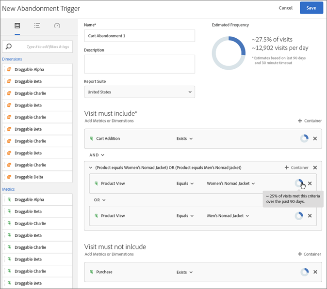

# Utlösare

## Översikt över utlösare {#topic_4F21FCE9A64E46E8B6D51F494FA652A7}

Med triggers kan ni identifiera, definiera och övervaka viktiga konsumentbeteenden och sedan generera kommunikation mellan olika lösningar för att återengagera besökarna. Ni kan använda triggers i realtidsbeslut och personalisering.

* Konfigurera snabb ommarknadsföring för övergivna varukorgar eller övergivna varukorgar med borttagna produkter
* Ofullständiga formulär och ansökningar
* Åtgärder eller sekvenser av åtgärder på platsen

### Typer av utlösare

I allmänhet kan en utlösare ta 15-90 minuter att starta en marknadsföringskampanj. Detta varierar beroende på implementering av datainsamling, inläsning på pipeline, anpassad konfiguration av den definierade utlösaren och arbetsflödet i Adobe Campaign.

* **Övergiven:** Du kan skapa en utlösare som aktiveras när en besökare tittar på en produkt men inte lägger till något i kundvagnen.
* **Åtgärd:** Du kan skapa utlösare, till exempel, som aktiveras efter anmälan till nyhetsbrev, e-postprenumerationer eller program för kreditkort (bekräftelser). Om du är återförsäljare kan du skapa en utlösare för en besökare som registrerar sig för ett lojalitetsprogram. I media och underhållning skapar du triggers för besökare som tittar på en viss show och kanske vill svara med en enkät.
* **Sessionsstart och sessionsslut:** Skapa en utlösare för händelser för sessionsstart och sessionsslut.

## Create an Experience Cloud trigger {#task_821F37183AC045E5AC8EED20317598FE}

Skapa en utlösare och konfigurera villkoren för utlösaren. Du kan till exempel ange villkor för en utlösares regler under ett besök, till exempel mått som Cart Abandon eller dimensioner som produktnamnet. När reglerna är uppfyllda körs utlösaren.

>[!NOTE]
>
>Det finns för närvarande en teknisk gräns på 100 utlösare.

1. Klicka på Experience Cloud och sedan på **[!UICONTROL Launch]**.
2. Leta reda på [!UICONTROL Triggers] kortet och klicka sedan på **[!UICONTROL Manage Triggers]**.
3. Klicka **[!UICONTROL New Trigger]** och ange sedan typ av utlösare:

   

4. Konfigurera utlösaren genom att fylla i följande fält och dra mått och dimensionsobjekt till regelns behållare:

   | Element | Beskrivning |
   |--- |--- |
   | Namn | Det egna namnet för den här utlösaren. |
   | Beskrivning | Beskrivningen av den här utlösaren, hur du kommer att använda den och så vidare. |
   | Report Suite | Analytics- [rapportsviten](https://docs.adobe.com/content/help/en/analytics/implementation/analytics-basics/ref-reports-report-suites.html) som används för den här utlösaren. Den här inställningen identifierar de rapportdata som ska användas. |
   | Besök måste inkluderaVisit får inte innehållaTrigger efter inga actionInclude-metadata | Du kan definiera villkor eller besökarbeteenden som du vill ska inträffa och beteenden som du inte vill ska inträffa.  Regler för en enkel utlösare för övergivna varukorgar kan till exempel vara:<ul><li>Besök måste omfatta följande:  Cart Addition (metric) och Exists. (Du kan förfina regeln ytterligare med en viss produktvy eller med dimensioner som webbläsartyper.)</li><li>Besök får inte omfatta  Checka ut.</li><li>Utlös efter ingen åtgärd för:  10 minuter.</li><li>Inkludera metadata: Gör att du kan lägga till en viss Campaign-dimension eller variabler som är relevanta för en besökares beteende. Det här fältet kan vara användbart för Adobe Campaign att skapa rätt e-postmeddelande för återmarknadsföring.</li></ul> Du kan ange Any (Alla) och eller Or (Logik) i eller mellan behållare, beroende på vilka kriterier du anger är viktiga för regeln. |
   | Behållare | Behållare är där du anger och lagrar regler, villkor eller filter som definierar en utlösare. Om du vill att händelser ska inträffa samtidigt placerar du dem i samma behållare. Det innebär att varje behållare bearbetas oberoende på träffnivå.  Om du till exempel har två behållare som förenas med operatorn And kan du förvänta dig att reglerna kvalificeras när två träffar uppfyller kraven. |
   | Starta ny session efter | Skapa en utlösare för händelser för sessionsstart och sessionsslut. |

5. Klicka på **[!UICONTROL Save]**.
6. Använd triggers för återmarknadsföring [i](https://docs.adobe.com/content/help/en/campaign-standard/using/integrating-with-adobe-cloud/working-with-campaign-and-triggers/about-adobe-experience-cloud-triggers.html) realtid i [!DNL Adobe Campaign].

### Exempelutlösare

Exempel på utlösare för Experience Cloud:

#### Cart Abandonment Trigger

På följande sida visas regler som du kan använda för en Cart Abandonment-utlösare, baserat på vilka produkter som visas under ett besök.

#### Utlösare för referent

Följande utlösare utlöses när en träff kommer in med produkten av Men&#39;s Boots och Facebooks hänvisningsprogram. För att de två kriterierna (*produkter* och *referent*) ska utvärderas i samma träff, bör de läggas till i samma behållare.

