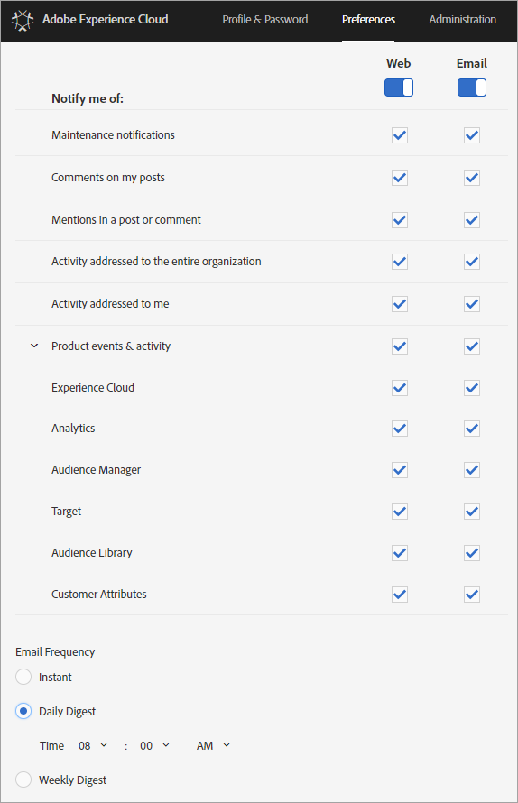

# Logga in och hantera dina Experience Cloud-profilinställningar

Om du loggar in på Experience Cloud (i stället för att logga in i en enda lösning) kan du logga in på alla lösningar och tjänster som du äger. I den här hjälpen beskrivs hur du loggar in på Experience Cloud, hanterar lösenord och meddelanden och anger en standardstartsida.

>[!IMPORTANT]
>
>Administratörer kan läsa [Administration](../admin-getting-started/admin-getting-started.md#topic_3FCB4099640647E3B2411ADBFCE81909) för information om uppdateringar av användar- och produkthantering.

## Logga in på Experience Cloud (administratörer) {#task_034FC955031347F3B02B686A09801A08}

Logga in och verifiera att du är i rätt [organisation](../admin-getting-started/organizations.md#topic_C31CB834F109465A82ED57FF0563B3F1).

1. Klicka på menyn Experience Cloud ( ) och sedan på **[!UICONTROL Administration]**.

   Om länken **[!UICONTROL Administration]** inte visas är du inte Experience Cloud-administratör för den visade [organisationen](../admin-getting-started/organizations.md#topic_C31CB834F109465A82ED57FF0563B3F1). Om du behöver hjälp med att bli administratör kontaktar du kundtjänst eller en befintlig Experience Cloud-administratör i ditt företag.
1. Klicka på **[!UICONTROL Administration]**.

1. Fortsätt genom att klicka på någon av följande länkar:

| Element | Beskrivning |
|--- |--- |
| [Grundläggande om Admin Console](https://helpx.adobe.com/marketing-cloud/how-to/first-time-setup.html) | Läs mer om de första stegen du måste ta för att komma igång med Experience Cloud. |
| [Ställ in identitet](https://helpx.adobe.com/enterprise/using/set-up-identity.html) | Definiera och konfigurera ett identitetssystem som slutanvändarna ska autentiseras mot. |
| [Användarhantering](https://helpx.adobe.com/se/enterprise/using/users.html) | Läs om hur du loggar in på Admin Console och hanterar användarbehörigheter och produktprofiler för Experience Cloud. |
| [Starta Admin Console](../admin-getting-started/admin-getting-started.md) | Admin Console är den centrala platsen för hantering av användare i Adobe och produktbehörigheter i hela organisationen. Du kan också logga in på Admin Console med en  [direktlänk](https://adminconsole.adobe.com). |
| [Hantera Creative Cloud-användare](../experience-cloud-assets/t-admin-add-cc-user.md) | Med Experience Cloud Assets kan marknadsförarna dela, synkronisera och samarbeta i mappar med designers och andra kreativa resurser med Creative Cloud. Du kan hantera de Creative Cloud-användare som är godkända för att samarbeta med din organisation här. |
| [Kartlägg dina rapportsviter](../core-services/core-services.md) | (Endast analyser) Experience Cloud bastjänster är kopplade till en organisation i stället för till en enskild rapportserie. För att dessa tjänster ska fungera på rätt sätt måste varje analysrapportsserie mappas till en organisation. (Den här uppgiften ingår i ett större arbetsflöde för att [aktivera Analytics för bastjänster](../core-services/core-services.md#concept_07ED1D5C64234E77976E6D572E78FB9C)). |
| [Organisations-ID](../admin-getting-started/organizations.md) | *Organisations-ID* finns längst ned på administrationssidan. Detta ID är det associerade ID:t med ditt tilldelade Experience Cloud-företag. Detta ID är en alfanumerisk sträng med 24 tecken, följt av (och måste innehålla) @AdobeOrg. |

## Logga in på Experience Cloud (användare) {#task_1BFE87E20DCB44078CAC82F3CD44B985}

Hjälp för icke-administrativa användare som loggar in på Experience Cloud.

1. Kontrollera med administratören att din [organisation](../admin-getting-started/organizations.md) har etablerats i Experience Cloud.

1. Navigera till [Adobe Experience Cloud](https://experiencecloud.adobe.com) ([!DNL experiencecloud.adobe.com]).
1. Klicka på **[!UICONTROL Sign In With Adobe ID]**.

   Din Experience Cloud-administratör kan hjälpa dig att fastställa kontotypen (Adobe ID eller Enterprise ID).

1. På landningssidan klickar du på väljarikonen  för att öppna den nedrullningsbara menyn.

   

   Vilka lösningar och tjänster som visas på den här menyn beror på vilka programbehörigheter din [administratör](../admin-getting-started/admin-getting-started.md#topic_3FCB4099640647E3B2411ADBFCE81909) har.

## Konfigurera standardinställningar för personliga konton {#task_73CBCAE6C91749D19C95421E5AC311BA}

Du kan redigera personlig information och ange en standardsida för [organisation](../admin-getting-started/admin-getting-started.md#concept_705C626560A54CA2A4215F1C870C42B2) och en landningssida som ska visas när du har loggat in på Experience Cloud.

1. Logga in på Experience Cloud och klicka sedan på din profilikon.

   
1. Klicka på **[!UICONTROL Edit Profile]**.

   
1. Fortsätt konfigurera och redigera personlig information och klicka sedan på **[!UICONTROL Save Changes]**.

## Aktivera meddelanden {#concept_0105453AD71847B8BFCAF4A40915F157}

Få meddelanden (via e-post eller i produkten) om systemuppdateringar, underhållsmeddelanden, inlägg, omnämnanden och delade resurser. Du kan också ange de produkter och lösningar som du vill få meddelanden om, inklusive överföringsstatus för kundattribut.

Om du vill navigera till Meddelanden klickar du på ikonen **[!UICONTROL Notifications]**  och sedan på ikonen **[!UICONTROL Settings]** .

Du kan sortera meddelandevisningen baserat på de meddelandetyper som är viktiga för dig och söka efter meddelanden. Du kan även:

* Sortera efter de meddelandetyper som är viktiga för dig.
* Sök efter meddelanden.

**Aktivera meddelanden**

<!-- 
 <b>Analytics</b> 
 
<ul id="ul_91BF597858124FA5BF338C36F6C5533F"> 
 <li id="li_FAD3E93CDE6242F58F14D55C8A6E23D7">Contribution analysis completed </li> 
 <li id="li_03D33D3228884CECA371B58656B2F3E7">Guided analysis shared </li> 
 <li id="li_DCF710F89317487B8DAA86CC05C694CA">Scheduled report failure </li> 
</ul> 

 <b>Adobe Target</b> 
 

Test started or stopped 
 

 <b>Media Optimizer</b> 
 

Performance alerts 
 

 <b>Dynamic Tag Manager</b> 
 
<ul id="ul_9ACDA418933E40918744D9C32A57DD4B"> 
 <li id="li_4DD0FFD3D9F84A428703611EF767D4D0">New web property created </li> 
 <li id="li_C6B923012E9D40BA91F4CBF7D2D72986">New user added </li> 
 <li id="li_EB0B9D1CFDE24E6987935CCCBFC7892A">Approvals - publishing and approval status for new rules, data elements, and tools </li> 
 <li id="li_17B0B176FF85435FB7EDD4317BC18201">Property has been published </li> 
</ul> -->

## Hantera profiler och lösenord {#task_7B89F4F38E5A4C4EB0FF842953856382}

Du kan redigera din Experience Cloud-profil, ange en standardorganisation och en landningssida med mera.

1. Logga in på Experience Cloud.

1. Klicka på din profilbild på Experience Cloud.

   
1. Klicka på **[!UICONTROL Edit Profile]**.

   Fyll i fälten och alternativen under Personlig information på sidan Profil och lösenord.

## Återställa lösenordet {#task_46541A2806164CB1A4AE8239604E4EB1}

1. Gå till inloggningssidan för lösningen.
1. Klicka på **[!UICONTROL Forgot Password]**.

   Lösenordslänkningsproblem för Experience Cloud bör åtgärdas genom att ett lösenord återställs.

   För Adobe Analytics-användare går du till [https://sc2.omniture.com/password_recovery.html](https://sc2.omniture.com/password_recovery.html).

## Konfigurera lösningens inloggning med en direktlänk {#concept_8BE493A08786469B88B210E13F78FF2F}

Du kan också logga in på en viss sida i en lösning med hjälp av autentisering från Experience Cloud-gränssnittet.

### URL-mall

`https://<tenantId>.experiencecloud.adobe.com/<solutionname>?destURL=<fullURL>`

Exempel-URL:

`https://aem62tenant.experiencecloud.adobe.com/analytics?destURL=https%3A%2F%2Fsc.omniture.com%2Freports%2F11562.html`

>[!NOTE]
>
>Du måste koda en URL innan du skickar den till parametern `destURL`. (Kodarplatser som [URL-avkodare / Kodare](https://meyerweb.com/eric/tools/dencoder/) är tillgängliga.)

| Parameter | Beskrivning | Exempel | Obligatoriskt/valfritt |
|--- |--- |--- |--- |
| tenantId | Namnet på innehavaren som användaren ska logga in på. | aem62tenant | Valfritt |
| destURL | Den fullständiga URL:en till den plats där användaren ska tas till. | https://sc.omniture.com/x/1_7xxzf | Valfritt |
| lösningens namn | Namnet på MAC-lösningen som är ägare av parametern destURL. Den används för att verifiera att användaren har åtkomst till lösningen som är URL-adressens ägare.  Lösningarna måste se till att lösningens namn är synkroniserat med parametern destURL.  Till exempel: Om URL:en innehåller lösningens namn som social och den angivna destURL:en är en analys-URL:en, kommer användaren att omdirigeras till URL:en även om han eller hon inte har tillgång till analyser. MAC verifierar INTE vädret som ägaren av destURL är synkroniserad med lösningens namn. | analys | Obligatoriskt om destURL-param används. |
