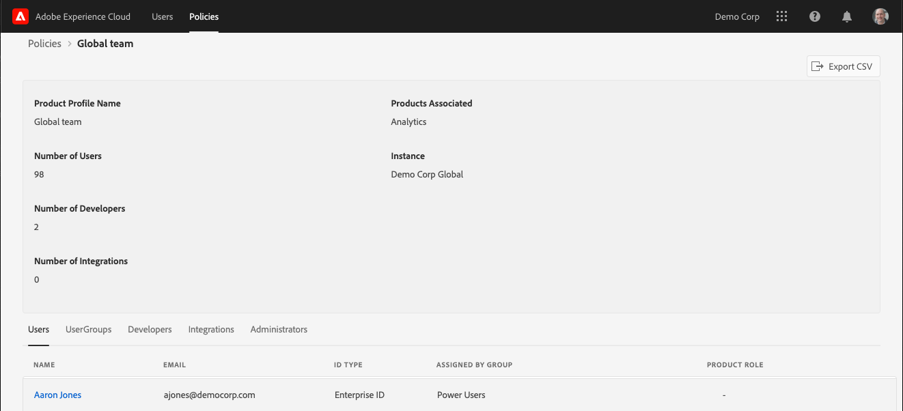

# Visa användare och profiler för Experience Cloud i administrationsverktyget

Administratörer kan visa en sorterbar och filterbar lista över alla användare och profiler i Experience Cloud med information i Admin Tool. Användarinformationen innehåller information om en användares produktåtkomst, roller och den senast öppnade informationen. Principinformationen omfattar användare, grupp, utvecklare, integrering och administratörslista för en princip (produktprofil) samt detaljerad behörighet och resursinformation för principen.

>[!NOTE]
>
>Användar- och produkthantering är konfigurerad i [Admin Console](admin-getting-started.md).

1. Logga in på `https://experience.adobe.com/.`

   

1. Under [!UICONTROL Quick Access] klickar du på **[!UICONTROL Admin Tool.]**

   (I hemsidans URL kan du även ersätta _home_ med _admin._)

   Sidan [!UICONTROL Users] visas.

## Sidan Användare

På den här sidan visas en fullständig lista över användare som har tillgång till Experience Cloud i din organisation. Här finns information om lösningsberättigande och senaste inloggning. Du kan söka, sortera och filtrera efter anpassade vyer av användarlistan.

| Element | Beskrivning |
|---|---|
| [!UICONTROL Name] | Användarens för- och efternamn. Du kan sortera den här kolumnen från A till Z och Z till A.  Klicka på en användares namn för att se mer information om användaren. |
| [!UICONTROL Email] | E-postadressen som är associerad med användaren. Kolumnen kan sorteras A->Z, Z->A. |
| [!UICONTROL ID Type] | Identitetstypen för användarens konto. Du kan använda filter för att visa specifika ID-typer. Mer information finns i [Hantera identitetstyper](https://helpx.adobe.com/enterprise/using/identity.html). |
| [!UICONTROL Solutions] | Sammanfattning av Experience Cloud-lösningar som användaren kan komma åt. Du kan använda filter för att begränsa listan över användare med specifik lösningsåtkomst. |
| [!UICONTROL Last Login] | Tid och datum för den senaste användarens inloggning på Experience Cloud. Den här kolumnen kan sorteras efter stigande eller fallande datum.   **Viktigt:** Från och med den 13 januari 2020 sparas användarens senaste inloggningsuppgifter i 365 dagar. Denna information är avsedd att visa den aktuella inloggningsaktiviteten i Experience Cloud och inte en rekommendation om att vidta åtgärder för inaktiva konton före den 13 januari 2020. |

## Anpassa användarlistvyn

Du kan söka efter, sortera eller filtrera kolumnerna för att anpassa användarlistan.

* Sök efter användare efter namn eller e-post. Sökningar matchar textsträngen som du skriver.
* Sortera kolumnen efter stigande eller fallande värden. Den här sorteringen gäller för [!UICONTROL Name,] [!UICONTROL Email,] och [!UICONTROL Last Login] kolumner.
* Om du vill använda flera filter för att lista användare med särskilda villkor klickar du på ikonen **[!UICONTROL Filter By]**. När flera filterkategorier används innehåller sökningarna e-postdomänen `AND` ID TYPE `AND` Solution.

| Element | Beskrivning |
|---------|----------|
| [!UICONTROL Email Domain] filter | Sök efter teckensträngar i kolumnen E-post om du vill begränsa resultatet till en eller flera domäner. Lägg till flera filter genom att trycka på Retur efter varje sökord |
| [!UICONTROL ID Type] filter | Välj bland tillgängliga ID-typer. Flera ID-typer kan användas som filter. |
| [!UICONTROL Solution] filter | Välj bland tillgängliga lösningar. Flera lösningsfilter söker efter resultat som innehåller Lösning 1 `OR` Lösning 2. |

## Visa användarinformation

Klicka på användarens e-postadress på sidan [!UICONTROL Users] om du vill visa information om en användare.

En detaljerad vy över varje användare visar viktig information om användarens lösningsåtkomst, admin- och produktroller samt information om den senaste åtkomsten.

## Avsnittet Om

I det här avsnittet visas en sammanfattning av användarkontot, inklusive:

* User Avatar and System Admin Badge (om tillämpligt)
* Namn
* E-post
* Användarnamn (Federated ID kan ha andra användarnamn än e-postadressen)
* [ID-typ](https://helpx.adobe.com/enterprise/using/identity.html)
* Land
* Senaste inloggning

## Sammanfattning av lösningar

I det här avsnittet visas en sammanfattning av Experience Cloud-lösningar som användaren kan komma åt. Inkluderar den administrativa rollen för produkten när det är tillämpligt.

## Detaljerad lista över produktåtkomst

I det här avsnittet visas en fullständig lista över alla produktprofilmedlemskap för användaren.

| Element | Beskrivning |
|---------|----------|
| [!UICONTROL Product] | Namn på den produkt som är associerad med produktprofilen. |
| [!UICONTROL Instance] | Namn på den instans (till exempel inloggningsföretag eller innehavare) som är associerad med produkt- och produktprofilen. |
| [!UICONTROL Product Profile] | Unikt namn på produktprofilen. |
| [!UICONTROL Assigned by Group] | Namnet på den användargrupp som associerar användaren med en produktprofil. Tomma resultat indikerar att användaren tilldelades produktprofilen direkt, inte via en grupp. |
| [!UICONTROL Product Roles] | Rolltilldelning av användaren i produktprofilen. För närvarande gäller dessa uppgifter endast Adobe Target produktprofiler. |

## Sidan Profiler

På den här sidan visas en fullständig lista över policyer för Experience Cloud i din organisation. Det innehåller information om produkter, instanser, användare och utvecklare. Du kan söka efter, sortera och filtrera efter anpassade vyer i principlistan.

| Element | Beskrivning |
|---|---|
| [!UICONTROL Product Profile] | Namnet på produktprofilen. Kolumnen kan sorteras A->Z, Z->A. Klicka på en produktprofils namn om du vill se mer information om profilen. |
| [!UICONTROL Product] | Den produkt som är associerad med produktprofilen. Kolumnen kan sorteras A->Z, Z->A. |
| [!UICONTROL Instance] | Den instans (till exempel klient- eller inloggningsföretag) som är associerad med produktprofilen. Produkter som inte har unika instanser eller innehavare visas med &quot; -&quot; som värde. Kolumnen kan sorteras A->Z, Z->A. |
| [!UICONTROL Number of Users] | Unikt antal användare som är associerade med produktprofilen, inklusive direkttilldelning och grupptilldelning. Kolumnen kan sorteras från minsta till största eller från största till minsta. |
| [!UICONTROL Number of Developers] | Antal utvecklarroller som är associerade med produktprofilen. Kolumnen kan sorteras från minsta till största eller från största till minsta. |

## Anpassa listvyn för profiler

Du kan söka efter, sortera eller filtrera kolumnerna för att anpassa principlistan.

* Sök efter produktprofiler efter namn. Sökningar matchar textsträngen som du skriver.
* Sortera kolumnen efter stigande eller fallande värden. Den här sorteringen gäller för [!UICONTROL Product Profile,] [!UICONTROL Product,] [!UICONTROL Instance,] [!UICONTROL Number of users,] och [!UICONTROL Number of Developers,] kolumner.
* Klicka på ikonen **[!UICONTROL Filter By]** om du vill använda flera filter för att lista produktprofiler med specifika villkor. När flera filterkategorier används innehåller sökningarna grupper som är associerade med `AND`-instansen `AND`-lösningen.

| Element | Beskrivning |
|---------|----------|
| [!UICONTROL Instance] filter | Sök efter teckensträngar i instanskolumnen för att begränsa resultatet till en eller flera förekomster. Lägg till flera filter genom att trycka på Retur efter varje sökord. |
| [!UICONTROL Solution] filter | Välj bland tillgängliga lösningar. Flera lösningsfilter söker efter resultat som innehåller Lösning 1 `OR` Lösning 2. |

## Visa policyinformation

Klicka på produktprofilens namn på sidan [!UICONTROL Policies] om du vill visa information om en profil.

En detaljerad vy över varje produktprofil innehåller viktig information om ämnen i produktprofilen (användare, grupper och så vidare). Här visas även behörigheter och resurser som har aktiverats av produktprofilen.

Information om produktprofilen kan exporteras till CSV-filer. Alternativet [!UICONTROL Export CSV] skapar två CSV-filer:

* Ämnesinformation (användare, användargrupper, utvecklare, integreringar, administratörer)
* Behörighets- och resursobjekt

## Sammanfattningsavsnitt

I det här avsnittet visas en sammanfattning av produktprofilen, inklusive:

* Produktprofilnamn
* Antal användare
* Antal utvecklare
* Antal integreringar
* Associerade produkter
* Instans

## Detaljerad ämneslista

I det här avsnittet visas en fullständig lista över alla användare, användargrupper, utvecklare, integreringar och administratörer som har tilldelats produktprofilen.

| Tabb | Beskrivning |
|---------|----------|
| [!UICONTROL Users] | Lista över användare som ingår i produktprofilen. Användargruppsassociationen visas i kolumnen [!UICONTROL Assigned by group]. |
| [!UICONTROL User Groups] | Lista med användargrupper som är associerade med produktprofilen. |
| [!UICONTROL Developers] | Lista med utvecklare som är associerade med produktprofilen. |
| [!UICONTROL Integrations] | Lista över integreringar som är associerade med produktprofilen. |
| [!UICONTROL Administrators] | Lista med administratörer som är associerade med produktprofilen. |

## Detaljerade behörighetslistor och resurslistor

I det här avsnittet visas en fullständig lista över de behörigheter och resurser som är tillgängliga för produktprofilen. Behörigheter och resurser som har inkluderats i produktprofilen har markerats med ett &quot; ✔&quot;. Listorna med behörigheter och resurser har kategoriserats i flikar och kolumner så att de blir lättare att visa. På flikar och kolumner visas en lista med avsnitt som gäller för den aktuella produkten.
