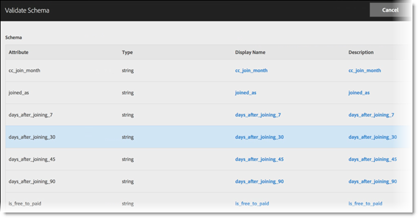

# Validera schemat

Med valideringsprocessen kan du mappa visningsnamn och beskrivningar till överförda attribut (strängar, heltal, tal och så vidare). Ett schema skapas baserat på dessa inställningar. Schemat används för att validera alla framtida data som överförs till den här datakällan. Denna mappningsprocess ändrar inte originaldata.

>[!NOTE]
>
>Om du uppdaterar schemat efter valideringen tas kundattributen bort. Se [Uppdatera schemat (tar även bort attribut)](../attributes/t-crs-usecase.md#task_6568898BB7C44A42ABFB86532B89063C).

**[!UICONTROL Customer Attribute Source]** > **[!UICONTROL Create New Customer Attribute Source]** > **[!UICONTROL View/Edit Schema]**

På sidan [!UICONTROL Validera schema] representerar varje rad i schemat en kolumn i den överförda CSV-filen.

* **[!UICONTROL Lägg till data:]** Överför nya attributdata till den här datakällan.

* **[!UICONTROL Visa/redigera schema:]** Mappa visningsnamn till attributdata enligt beskrivningen i nästa steg.

* **[!UICONTROL FTP-inställningar:]** [Överför data via FTP](../attributes/t-upload-attributes-ftp.md#task_591C3B6733424718A62453D2F8ADF73B).

* **[!UICONTROL ID-sökning:]** Ange ett kund-ID (CID) från ditt `.csv` konto för att söka efter Experience Cloud-information för ID:t. Den här funktionen är användbar för att felsöka varför attributdata inte visas för en besökare:

   * **[!UICONTROL ECID (Experience Cloud ID):]** Visar om du använder den senaste Experience Cloud ID-tjänsten. Om du är med i MCID-tjänsten men det inte finns några ID:n listade här, har Experience Cloud inte fått något alias för det CID:t. Det innebär att besökaren inte har loggat in eller att implementeringen inte skickar det ID:t till.

   * **[!UICONTROL CID (Kund-ID):]** De attribut som är associerade med detta CID. Om du använder en prop eller eVar för att överföra CID:n (AVID), och du ser attribut som visas men inget AVID, indikerar detta att besökaren inte har loggat in på din plats.

   * **[!UICONTROL AVID (Analytics-besökar-ID):]** Visar om du använder en prop eller eVar för att överföra CID:n. Om dessa ID:n skickas till Experience Cloud visas alla besökar-ID:n som är kopplade till det CID du angav här.

Du kan också överföra data via FTP när du har skapat en kundattributkälla och ett FTP-konto i Experience Cloud. Du skapar ett FTP-konto per attributkälla. De överförda filerna lagras i kontots rotmapp. Data måste vara i .csv-format, med en andra .fin-fil som anger att överföringen är slutförd

De namn du anger för strängar, heltal och tal används för att skapa [!DNL Analytics] mätvärden. Mer information finns i [Kundattributrapporten](https://docs.adobe.com/help/en/analytics/components/variables/dimensions-reports/reports-customer-attributes.html) i [!DNL Analytics] hjälpen.

* **[!UICONTROL Attribut:]** Attributdata läses från den överförda `.csv` filen.

* **[!UICONTROL Typ:]** Datatypen, till exempel:

   * **Sträng:** En teckensekvens.

   * **Heltal:** Heltal.

   * **Nummer:** Kan innehålla upp till två decimaler.

* **[!UICONTROL Visningsnamn:]** Ett eget namn för attributet. Du kan till exempel ändra ett attribut till *kundens ålder* till *Kund sedan*.

* **[!UICONTROL Beskrivning:]** En användarvänlig beskrivning av attributet.
