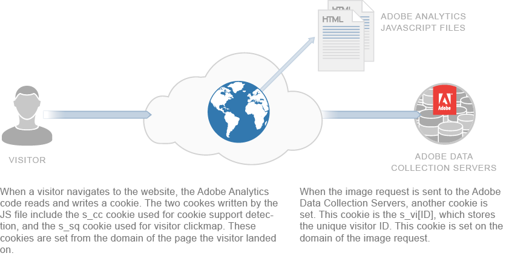

# Om cookies och sekretess{#about-cookies-and-privacy}

Att upprätthålla kundens integritet och datasäkerhet är de viktigaste prioriteringarna på Adobe. Adobe deltar i flera integritetsorganisationer och samarbetar med integritetsreglerande organ och självreglerande principer. Samarbetet innefattar Digital Advertising Alliance AdChoices-programmet för att ge kunderna information om hur deras information används och vilka val som görs för användningen.

De flesta cookies som anges av Experience Cloud-produkter innehåller ingen personligt identifierbar information. Dessa cookies och tillhörande data är säkra och används endast för företagets rapporter och för att tillhandahålla relevant innehåll och relevanta annonser. Uppgifterna är inte tillgängliga för tredje part eller andra Adobe-kunder, såvida de inte används i aggregerade branschrapporter. Till exempel [!DNL Digital Marketing Insight Report] analyserar aggregerade och anonyma uppgifter från olika återförsäljare.

Adobe sammanfogar inte information på webbläsarnivå över olika företag. För att skydda kundens integritet och säkerhet erbjuder vissa av tjänsterna i Experience Cloud företag möjligheten att använda separata cookies för varje webbplats som spåras. Vissa av Suite-erbjudandena erbjuder även kunder möjlighet att använda sitt eget domännamn som ägare av cookien. Den här metoden skapar ett extra lager av sekretess och säkerhet, eftersom den gör Experience Cloud-cookies *cookies från första part* som permanent tillhör företagets webbplats.

Cookies kan endast lagra och tillhandahålla den information som tidigare lagrats i dem. De kan inte köra kod eller komma åt annan information som lagras på datorn. Webbläsare begränsar även åtkomsten till cookie-data. Webbläsare tillämpar en skyddsprofil för cookies som gör alla cookie-data tillgängliga endast för den webbplats som ursprungligen angav informationen.

Data som finns i cookies-uppsättningar från Adobe.com webbplats kan till exempel inte visas av någon annan webbplats än Adobe.com.

I följande diagram visas användningen av cookies för en standardbildbegäran:

I följande diagram visas cookie-användning för en rak bildbegäran (används i scenarier där en JS-fil inte har lästs in):

