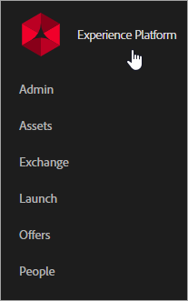

# Om bastjänster {#topic_C1087DCC538F4F9A99D983C1BB29EBE0}

Klicka på menyikonen i Experience Cloud  för att öppna den nedrullningsbara menyn.

Adobe Experience Platform centraliserar och standardiserar data och innehåll i hela företaget. Produktdokumentationen finns på [Adobe.io](https://www.adobe.io/apis/experienceplatform/home/services.html).

| Element | Beskrivning |
|--- |--- |
| [Administratör](admin-getting-started/admin-getting-started.md) | Hantera användarrättigheter och produktprofiler för Experience Cloud. |
| [Resurser](experience-cloud-assets/experience-cloud-assets.md) | Experience Cloud Assets utgör en enda central lagringsplats med marknadsföringsklart material som ni kan dela mellan olika lösningar. |
| [Exchange](https://experiencecloud.adobeexchange.com/) | Utöka funktionaliteten i Adobe Experience Cloud med de bästa tilläggen, skripten med mera. Utforska med sökfältet eller sortera efter produkt eller apptyp. |
| [Starta](activation/activation.md) | Datainsamling och teknikaktivering för webbplatser och appar. Den innehåller följande uppgifter:<ul><li>Experience Platform Launch (den senaste tagghanteringslösningen)</li><li>Dynamisk tagghantering</li><li>Utlösare</li></ul> |
| [Erbjudanden](offer-management/getting-started.md) | Skapa, hantera och fatta beslut i alla kanaler i Experience Cloud. [!UICONTROL Offer Management] fungerar som en central katalog för erbjudanden där ni kan koppla samman regler för behörighet och flera innehållsdelar med varje erbjudande, publicera dessa erbjudanden över olika kanaler och platser och leverera det bästa erbjudandet för varje kund vid varje interaktion. |
| [Mobiltjänster](https://docs.adobe.com/content/help/en/mobile-services/using/home.html) | Mobiltjänster samlar funktioner för mobilmarknadsföring för mobilappar från hela Adobe Marketing Cloud, vilket gör att ni kan förstå och förbättra användarengagemanget i era mobilappar. |
| [Folk](audience-library/audience-library.md) | I målgruppsbiblioteket kan du skapa målgrupper, kombinera befintliga målgrupper för att skapa sammansatta målgrupper och visa alla delade målgrupper. I kundattribut kan du även överföra företagskunddata till Experience Cloud. |
