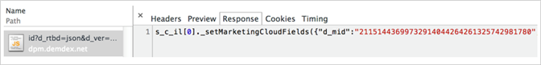
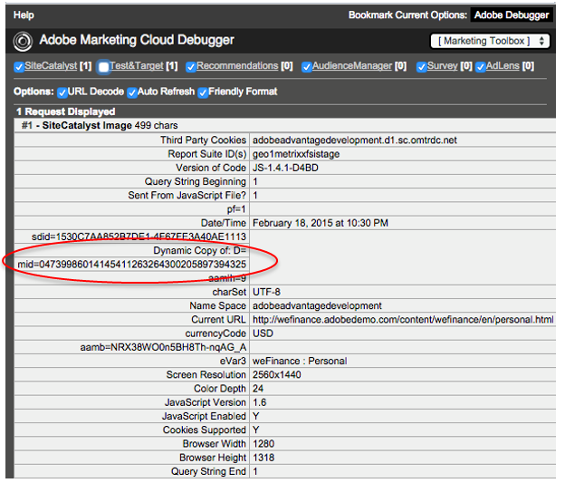

# Aktivera implementeringen av Experience Cloud-tjänster

Om du nyligen har implementerat Experience Cloud med Experience Platform Launch har du redan ställt in kundattribut och Experience Cloud målgrupper. Du kan också hantera användare och produkter i Admin Console.

Befintliga kunder kan modernisera sina applikationsimplementationer och implementera Experience Cloud. På så sätt kan ni använda kundattribut och målgruppsfunktioner i Adobe Analytics, Audience Manager och Adobe Target. För att implementera detta kommer du att:

1. [Gå med i Experience Cloud och bli administratör](#section_2423F0BD3DF642658103310EE5EA6154)
1. [Implementera tjänsten Experience Cloud ID](#section_3C9F6DF37C654D939625BB4D485E4354)
1. [Mappa rapportsviter till en Experience Cloud-organisation](#section_7B08516B01BA421681DF03D0E86CE3BA)
1. [Uppdatera din Analytics AppMeasurement-kod](#section_1798D9D0F05C47E29816AC4EEB9A0913)
1. [Uppdatera implementeringen av Adobe Target](#section_C2F4493C7A36406DAE2266B429A4BD24)
1. [Verifiera implementeringen](#section_E641782A0F4F44AF8C9C91216BE330D5)
1. [Hantera användare och produkter](#section_B6E95F4E0E12483CB9DA99CBC0C5A4AF)
1. [Börja dela attribut och målgruppsdata](#section_960C06093623462E8EA247B3E97274A1)

## Gå med i Experience Cloud och bli administratör {#section_2423F0BD3DF642658103310EE5EA6154}

Vad du måste göra för att gå med i Experience Cloud:

1. Kontrollera att du har rätt SKU för Adobe Analytics eller Adobe Target.

   * **Adobe Analytics:** Standard eller Premium (inte äldre) [!DNL SiteCatalyst] SKU).
   * **Adobe Target:** Standard eller Premium.

   >[!NOTE]
   >
   >För [!DNL Target], migrera till at.js från [!DNL mbox.js]. Se [Uppgraderar från at.js 1. x till at.js 2. x](https://experienceleague.adobe.com/docs/target-dev/developer/client-side/at-js-implementation/upgrading-from-atjs-1x-to-atjs-20.html).

1. Modernisera implementeringen och få status som administratör.

   * Följ stegen nedan i [Implementera [!UICONTROL Experience Cloud ID Service]](core-services.md#section_3C9F6DF37C654D939625BB4D485E4354).
   * Kontakta din kontohanterare och starta provisioneringsprocessen för Experience Cloud.

1. Hantera användare och produkter i [!UICONTROL Admin Console].

### Administratörsinloggning

När du är administratör kan du logga in på [experience.adobe.com](https://experience.adobe.com).

The **[!UICONTROL Admin Console]** -länken är tillgänglig i navigeringen på Experience Cloud-menyn.

Se [Experience Cloud och produktadministration](admin-getting-started.md#topic_3FCB4099640647E3B2411ADBFCE81909) för mer information.

### Användarinloggning

För att kunna logga in på Experience Cloud måste dina användare:

* Ha en Adobe ID (eller ett Enterprise ID för ditt företag).
* Logga in på [experience.adobe.com](https://experience.adobe.com).
* Tillhör en programgrupp som är mappad till en företagsgrupp.
* Länka vid behov deras programkonton till deras Adobe ID (beskrivs nedan).

### Valfritt: Länka befintliga användarkonton.

Det är sannolikt att du har användare som redan är medlemmar i programgrupper, till exempel en Analytics-grupp som du tidigare har hanterat i [!UICONTROL Analytics] > [!UICONTROL Admin Tools].

När du mappar de här grupperna till Experience Cloud Enterprise-grupper måste dessa användare manuellt länka sina inloggningsuppgifter för programkonton till sina Adobe ID.

Se [Länka konton i Experience Cloud](organizations.md#topic_C31CB834F109465A82ED57FF0563B3F1)

>[!NOTE]
>
>När enterprise- och programgrupper har mappats länkas nya användare automatiskt. (Autentiseringsuppgifter för lösningen skapas automatiskt och länkas till deras Adobe ID.)

I följande avsnitt beskrivs hur du moderniserar implementeringen. Genom att modernisera implementeringen kan du få tillgång till bastjänster i Experience Cloud.

## Implementera [!UICONTROL Experience Cloud ID Service] {#section_3C9F6DF37C654D939625BB4D485E4354}

The [!UICONTROL Experience Cloud ID Service] innehåller ett gemensamt ID för integrering mellan program. Det ger identifiering av besökare över domäner och en sökväg för målinriktning och personalisering mellan olika enheter/webbläsare baserat på CRM-data som överförs via [!UICONTROL Customer Attributes].

Det enklaste sättet att aktivera Experience Cloud bastjänster är att aktivera det automatiskt för Analytics och Adobe Target via [Experience Cloud ID-tjänsttillägg](https://experienceleague.adobe.com/docs/experience-platform/tags/extensions/adobe/id-service/overview.html?lang=en) in [!UICONTROL Experience Platform Launch].

Om du vill ha fullständig hjälp om Experience Cloud ID-tjänsten (tidigare besökar-ID) går du till [här](https://experienceleague.adobe.com/docs/id-service/using/intro/overview.html?lang=en#intro).

**Använder inte [!UICONTROL Experience Platform Launch] eller [!UICONTROL Dynamic Tag Management]?**

Om du inte använder [!UICONTROL Experience Platform Launch] eller [!UICONTROL Dynamic Tag Management]implementera ID-tjänsten manuellt via JavaScript-distributionen ([!DNL VisitorAPI.js]), enligt följande:

| Uppgift | Beskrivning |
| -----------| ---------- |  
| [Implementera Experience Cloud ID-tjänsten för analys](https://experienceleague.adobe.com/docs/id-service/using/implementation/setup-analytics.html?lang=en) | Adobe rekommenderar även att du anger ytterligare [kund-ID](https://experienceleague.adobe.com/docs/id-service/using/reference/authenticated-state.html?lang=en). Dessa ID:n är kopplade till varje besökare och aktiverar nuvarande och framtida funktioner i Experience Cloud. |
| Uppdatera din befintliga [!DNL s_code] till version H.27.3 eller senare, eller din befintliga [!DNL AppMeasurement.js] till version 1.4 eller senare. | De här filerna är tillgängliga för hämtning i [Kodhanteraren](https://experienceleague.adobe.com/docs/analytics/admin/admin-tools/code-manager-admin.html?lang=en) i Analytics Admin Tools. (Med [JavaScript-implementering](https://experienceleague.adobe.com/docs/analytics/implementation/js/overview.html?lang=en#js) kan du få mer information om [!DNL AppMeasurement.js].) |
| Synkronisera kund-ID för Analytics | Se [Analyser - synkronisera kund-ID](core-services.md#section_AD473A6A21C1446498E700363F9A8437) (nedan). |

{style="table-layout:auto"}

### Analytics &amp; Adobe Target - synkronisera kund-ID {#section_AD473A6A21C1446498E700363F9A8437}

Som en del av konfigurationen av tjänsten Experience Cloud ID rekommenderar Adobe att du använder Analytics och [!DNL Target] som du synkroniserar [kund-ID](https://experienceleague.adobe.com/docs/id-service/using/reference/authenticated-state.html?lang=en) med Experience Cloud.

I Adobe Target `mbox3rdpartyid` måste hämta kund-ID:t och skicka det till [!DNL Target]. (Se [Arbeta med kundattribut](https://experienceleague.adobe.com/docs/target/using/audiences/visitor-profiles/working-with-customer-attributes.html?lang=en) in [!DNL Target].)

När en besökare autentiserar sig på din webbplats, eller på annat sätt identifierar sig själv, måste din implementering visa den personens CRM-kund-ID för sidan eller appen. Sedan kan du använda rätt funktionsanrop för att synkronisera ditt kund-ID med Experience Cloud. Den här synkroniseringen lagrar besökarens CRM-kund-ID i Experience Cloud och aktiverar kundens attribut för användning i Experience Cloud.

Anta till exempel att Bob har ett kund-ID `52mc210tr42` i CRM-systemet. När Bob autentiserar på din webbplats måste du visa detta ID på sidan och använda ID:t för att synkronisera det på ett av två sätt:

* Utlysning `visitor.setCustomerIDs({"crm_id":"52mc210tr42"})` med besökar-ID-tjänsten. Eller
* Fyll i *`Customer ID (52mc210tr42)`* i en propp eller eVar.

Kund-ID måste anges för varje [!DNL Analytics] serversamtal där Kund-ID:t är känt.

#### Analyser: synkronisera kund-ID:t med bakåtfyllnadsmetoden i Data warehouse

När kundattribut blev tillgängliga hade vissa kunder ännu inte implementerat tjänsten Experience Cloud ID och kunde inte använda kundattribut på ett enkelt sätt. För att lösa detta problem skapade Adobe ett sätt att göra en bakåtfyllning av ID-synk med Adobe Analytics Data warehouse. Den här funktionen kallas för bakfyllning i Data warehouse. Bakåtfyllnaden i Data warehouse är nu i allmänhet inte nödvändig och därför kommer den inte längre att vara tillgänglig från och med oktober 2022.

### SDK för mobiler

Se *Experience Cloud ID-tjänst* för syntaxexempel om hur du anger ytterligare kund-ID i [Android™](https://experienceleague.adobe.com/docs/mobile-services/android/overview.html?lang=en) och [iOS](https://experienceleague.adobe.com/docs/mobile-services/ios/overview.html?lang=en) Mobilappar.

### Aktivera attribut för historiska data

Kundattributdata blir tillgängliga när besökarna loggar in. Om du ännu inte har implementerat ID-tjänsten, och om du historiskt har spårat kund-ID:n i en propp eller eVar, kan du begära en process som skickar historiska inloggningar till Experience Cloud. Med den här processen kan du börja använda kundattribut direkt.

Kontakta kundtjänst om du vill aktivera historikdata.

## Mappa rapportsviter till en Experience Cloud-organisation {#section_7B08516B01BA421681DF03D0E86CE3BA}

>[!NOTE]
>
>Rapportsvitens mappningsfunktion togs bort i november 2020. Kontakta kundsupporten om du har några frågor.

Experience Cloud (t.ex. Experience Cloud ID-tjänsten och [!UICONTROL People service]) är kopplade till en Experience Cloud-organisation i stället för till en enskild analysrapport. För att dessa tjänster ska fungera på rätt sätt måste varje analysrapport mappas till en Experience Cloud-organisation.

## Uppdatera din Analytics AppMeasurement-kod {#section_1798D9D0F05C47E29816AC4EEB9A0913}

Om du använder Analytics bör du kontrollera att du använder regional datainsamling (RDC). Om din datainsamlingsdomän är `omtrdc.net`eller om CNAME är mappat till `omtrdc.net`, du är på RDC. Se [Övergång till RDC](https://experienceleague.adobe.com/docs/analytics/technotes/rdc/regional-data-collection.html?lang=en) för mer information. Om du använder cookies från första part finns mer information i [CNAME och Experience Cloud ID-tjänsten](https://experienceleague.adobe.com/docs/id-service/using/reference/analytics-reference/cname.html?lang=en) om du vill ha information om CNAME för datainsamling och spårning mellan domäner.

Vi rekommenderar att du moderniserar din Analytics-implementering genom att uppdatera dina JavaScript-bibliotek, inklusive Visitor API. Det enkla sättet att uppnå är att lägga till en [Adobe Analytics-tillägg](https://experienceleague.adobe.com/docs/experience-platform/tags/extensions/adobe/analytics/overview.html?lang=en) i Experience Platform Data Collection (Launch).

## Uppdatera implementeringen av Adobe Target {#section_C2F4493C7A36406DAE2266B429A4BD24}

* Vi rekommenderar att du lägger till en [Adobe Target-tillägg](https://experienceleague.adobe.com/docs/experience-platform/tags/extensions/adobe/target-v2/overview.html?lang=en) in [!UICONTROL Experience Platform Launch]så att bibliotekshämtningen är automatisk. Du kan också konfigurera [Experience Cloud ID-tjänsttillägg](https://experienceleague.adobe.com/docs/experience-platform/tags/extensions/adobe/id-service/overview.html?lang=en) för Adobe Target (och andra program) använda [!UICONTROL Experience Platform Launch]. The [!UICONTROL Experience Cloud ID Service] uppdatera **krävs** för Adobe Target att använda bastjänsterna.
* Om du inte använder [!UICONTROL Experience Platform Launch], [uppdatera mbox-biblioteket](https://experienceleague.adobe.com/docs/target/using/implement-target/client-side/implement-target-for-client-side-web.html?lang=en) manuellt.
* Begär åtkomst att använda Adobe Analytics som rapportkälla för [!DNL Adobe Target]. [!DNL Target] och [!DNL Analytics] data kombineras på samma serveranrop under bearbetningen så att besökarna är anslutna mellan de två programmen. Se [Analyser för målinriktad implementering](https://experienceleague.adobe.com/docs/target/using/integrate/a4t/a4t.html?lang=en).

   >[!IMPORTANT]
   >
   >Alla Analytics-kunder har redan etablerats för bastjänster som kundattribut. Om du inte är Analytics-kund kontaktar du kundtjänst för att begära att få etableras.

## Verifiera implementeringen {#section_E641782A0F4F44AF8C9C91216BE330D5}

Använd följande process för att se till att Experience Cloud ID-tjänsten implementeras korrekt på din webbplats.

1. Rensa cookies för din webbplats så att du kan se begäran till Experience Cloud ID-tjänsten (begäran görs vid första besöket och sedan en gång per besökare per vecka).
1. Använd en paketanalyserare eller nätverkspanelen i en webbläsarfelsökare för att leta efter en begäran som ska [!DNL dpm.demdex.net].
1. Verifiera att svaret innehåller `d_mid` och ett värde, till exempel: `_setMarketingCloudFields({"d_mid":"4235...`
1. Verifiera att Analytics-begäran innehåller `mid` -parametern (Experience Cloud-ID). Under respitperioden (om den är aktiverad) bör du även se en `aid` parameter (Analytics besökar-ID).

Förväntat svar som innehåller Experience Cloud-ID:

Analytics-bildbegäran som innehåller Experience Cloud ID (kallas även `mid` eller _besökar-ID_):

Experience Cloud ID i mbox-begäran:

### Hur lång är fristen?

När du har distribuerat Experience Cloud ID-tjänsten får nya besökare inte längre något Experience Cloud-ID för Analytics från din datainsamlingsserver. Om delar av din webbplats ännu inte har implementerat ID-tjänsten identifieras inte Experience Cloud-ID:t när besökare bläddrar till de här avsnitten och besökarna tilldelas ett äldre besökar-ID för Analytics. Detta kan orsaka potentiella problem, inklusive dubblettbesök och felaktig attribuering.

Om supportavsnittet på webbplatsen till exempel hanteras i ett separat CMS-system kan du ha en annan Analytics JavaScript-fil för det här avsnittet. Om du distribuerar Experience Cloud ID på huvudwebbplatsen innan du distribuerar ID-tjänsten till supportwebbplatsen får nya besökare ett äldre Analytics ID när de besöker supportavsnittet. Besök som spänner över båda webbplatsavsnitten rapporteras som olika besök.

Distribuering av Experience Cloud ID-tjänsten på webbplatser som använder flera JavaScript-filer eller andra tekniker (till exempel Flash) kan orsaka problem med samordningen. Dessa problem uppstår eftersom du måste aktivera Experience Cloud ID-tjänsten på alla delar av platsen samtidigt. Genom att konfigurera en respitperiod kan nya besökare fortsätta att ta emot ett besökar-ID för Analytics från ID-tjänsten. Besökare kan identifieras på ett konsekvent sätt i avsnitt på platsen som inte har uppgraderats för att använda besökar-ID-tjänsten.

## Hantera användare och produkter {#section_B6E95F4E0E12483CB9DA99CBC0C5A4AF}

När du är igång går du till [Admin Console](https://adminconsole.adobe.com/), där du kan hantera användare och produktprofiler.

Se [Experience Cloud och produktledning](admin-getting-started.md#topic_3FCB4099640647E3B2411ADBFCE81909).

### Kundattribut

Användare som läggs till i [!UICONTROL Customer Attributes] gruppen kan se [!UICONTROL Customer Attributes] menyalternativet till vänster om Experience Cloud.

## Börja dela attribut och målgruppsdata {#section_960C06093623462E8EA247B3E97274A1}

Utnyttja följande funktioner.

### [!UICONTROL People] > [!UICONTROL Customer Attributes]

Om du samlar in data om företagskunder i en CRM-databas (customer relationship management) kan du överföra dessa data till en datakälla för kundattribut i Experience Cloud. Använd data i [!DNL Adobe Analytics] och [!DNL Adobe Target].

Se [Kundattribut](attributes.md#concept_ACFEE7C8B8E94875BA0825CDF4913AF1)

### [!UICONTROL People] > [!UICONTROL Audience Library]

Experience Cloud [!UICONTROL Audiences] är gränssnittet som gör att du kan skapa målgrupper, kombinera befintliga målgrupper för att skapa sammansatta målgrupper och visa alla delade målgrupper.

Se [Målgrupper](audience-library.md#topic_679810123CAA4E0CA4FA3417FB0100C7)

## Datalagring och sekretess

Om ni använder målgruppsprofilering i realtid och andra bastjänster i Adobe [!DNL Experience Cloud], kan användningen av dessa tjänster påverka vilket datacenter (och land) dina data finns i. Särskilt eftersom [!DNL Experience Cloud] använder Audience Manager, data som används i [!UICONTROL People] -tjänsten måste finnas på Audience Manager-servrar i USA.

När du använder tjänster som är tillgängliga via [!UICONTROL People] de typer av data som skickas från andra Adobe-produkter till målgruppshantering är:

* [!DNL Analytics] nyckel-/värdepar (props, eVars, list-var o.s.v.). Som standard innehåller loggraderna IP-adress, inklusive IP-adressens sista oktett (förutsatt att IP-adressen inte har ändrats av inställningarna för IP-förfalskning i Adobe) [!DNL Analytics]).
* Fackar och segment som besökare är kvalificerade för baserat på regler som har upprättats i Audience Manager.
* (Valfritt) Ett eller flera av dina ID:n. Beroende på din implementering av ID-tjänsten kan du även skicka in ett eller flera av dina ID:n, till exempel CRM-ID:n eller hash-kodade e-postadresser. Om dessa data skickas till Adobe [!DNL Analytics], överförs det till Adobe målgruppshantering. Adobe rekommenderar att man inte lämnar personuppgifter till Adobe [!DNL Analytics]. Använd i stället en envägshash för att maskera data innan de skickas till Adobe.
* Segment som härrör från [!DNL Analytics] via segmentdelning i bakgrunden
* Cookien demdex.net anges om cookies från tredje part inte blockeras. The `AMCV_###@AdobeOrg` cookie för första part anges alltid med Experience Cloud ID-tjänsten.

Alla dessa dataelement levereras till Adobe Audience Manager i form av loggfiler. Audience Manager bearbetar och lagrar dessa data i USA. Audience Manager har inget alternativ för att lagra eller bearbeta dessa data utanför USA.

### Cookies och Opt-Outs

Användning av målgruppsprofiler i realtid använder Audience Manager cookie, utöver de cookies som används för [!DNL Analytics] och [!DNL Target].

Om du vill ha rätt avanmälningsmöjlighet måste besökare på din webbplats lägga till avanmälan från Audience Manager i din befintliga avanmälningsprocess.

Se [Adobe Experience Cloud - Implementera Adobe Opt-Outs](https://experienceleague.adobe.com/docs/analytics/implementation/js/opt-out.html) för instruktioner.

Se [CNAME för datainsamling och spårning mellan domäner](https://experienceleague.adobe.com/docs/id-service/using/reference/analytics-reference/cname.html?lang=en) för att aktivera spårning mellan domäner.
