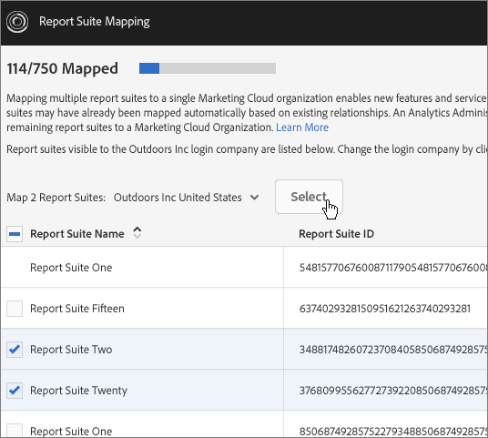

# Mappa rapportsviter till en organisation {#topic_7C4740559EAC4E0FA5F8DEF886B580DA}

>[!NOTE]
>
>Rapportsvitens mappningsfunktion kommer att bli inaktuell i november 2020. Kartlägg alla utestående rapportsviter som förberedelse för detta. Kontakta kundtjänst om du har några frågor.

Lär dig hur du mappar en eller flera rapportsviter till en organisation.

Experience Cloud-tjänster (som Experience Cloud ID-tjänsten och [!UICONTROL People]) är kopplade till en organisation i stället för till en enskild rapportserie. För att dessa tjänster ska fungera på rätt sätt måste varje analysrapportsserie mappas till en organisation. Mappningsprocessen:

* Anger en Experience Cloud-organisation som primär organisation för rapportsviten.
* Ändrar inte vem som har åtkomst till en rapportserie (åtkomsten bestäms fortfarande av Adobe Analytics inloggningskonto för varje användare)

## Krav

Du måste vara Analytics-administratör för ett inloggningsföretag som har tillgång till den rapportserie som du vill mappa. Dessutom måste det här kontot vara [länkat till en Experience Cloud-organisation](../admin-getting-started/organizations.md#topic_C31CB834F109465A82ED57FF0563B3F1) för att kunna mappa rapportsviter till den organisationen.

Organisationer är nedtonade om du inte har administratörsbehörighet för Analytics för ett inloggningsföretag inom den organisationen som har åtkomst till den angivna rapportsviten.

## Avbilda en rapportsvit till en organisation {#task_23993FE78DF6455FA8D7BE60686EA16C}

1. Navigera till Report Suites for Data Governance på [!DNL Analytics] > **[!UICONTROL Admin]** > **[!UICONTROL Data Governance]** (se [Visa/hantera rapportsvitens inställning för datastyrning)](https://docs.adobe.com/help/en/analytics/admin/data-governance/gdpr-view-settings.html)

1. Om du vill visa vilka inloggningsföretag som har åtkomst till varje rapportsvit klickar du på **[!UICONTROL Visible to Login Companies]**.

   Den här vyn är avsedd att hjälpa dig att fatta ett välgrundat beslut om mappningen.

1. Klicka på listrutan i **[!UICONTROL Mapped Organization]** kolumnen bredvid en rapportserie och välj den organisation som du vill mappa till.

   Tips om hur du väljer en Experience Cloud-organisation finns i nästa avsnitt.

## Mappa flera rapportsviter till en organisation {#task_94955B0D8ABA4CB1A38746ECF8E32711}

1. Klicka på **[!UICONTROL Experience Cloud]** > **[!UICONTROL Administration]** > **[!UICONTROL Report Suite Mapping]**.

1. Välj de rapportsviter som du vill mappa.

   

1. Välj organisation (Outdoor Inc, i det här exemplet) och klicka sedan på **[!UICONTROL Select]**.

   Tips om hur du väljer en Experience Cloud-organisation finns i nästa avsnitt.

1. Klicka på **[!UICONTROL Save Mapping]**.

## Tips för att välja en Experience Cloud-organisation {#mapping-tips}

Det här avsnittet innehåller tips som hjälper dig att välja den Experience Cloud-organisation som du ska mappa en rapportserie till.

### Vilken organisation ska jag välja?

Om Experience Cloud ID-tjänsten för närvarande är distribuerad till rapportsviten kontrollerar du att den organisation du väljer i verktyget för mappning av rapportsviten är densamma som anges i [!DNL visitorAPI.js] filen på din plats. Du kan använda instruktionerna i [Testa och verifiera Experience Cloud ID-tjänsten](https://docs.adobe.com/content/help/en/id-service/using/implementation-guides/test-verify.html) för att hitta det organisations-ID som används av Visitor ID-tjänsten.

Om besökar-ID-tjänsten ännu inte har distribuerats på webbplatser som samlar in data för rapportsviten måste du, om du i framtiden distribuerar Experience Cloud Visitor ID-tjänsten, se till att distributionen matchar den organisation du valde i verktyget för mappning av rapportsviten.

### Varför är vissa organisationer nedtonade?

Detta anger att du inte har tillräcklig behörighet för att mappa till den nedtonade rapportsviten. Titta på följande exempel:

I det här diagrammet anger den blå tangenten administratörsbehörighet. De grå linjerna visar synlighet.

Den här användaren har åtkomst till två Experience Cloud-organisationer. Han har utfört följande:

* Länkade sitt administratörskonto i inloggningsföretaget för [!UICONTROL chapek] Analytics till hans [!UICONTROL Chapek] organisationskonto för Corp Experience Cloud.
* Länkade sitt icke-administratörskonto i inloggningsföretaget för [!UICONTROL doohan] Analytics till sitt [!UICONTROL Chapek] organisationskonto för Corp Experience Cloud.
* Länkade sitt icke-administratörskonto i nigel Analytics-inloggningsföretaget till hans Nigel Inc Experience Cloud org-konto.

I följande punkter visas mappningsåtgärder som den här användaren kan och inte kan utföra för dessa rapportsviter:

* [!UICONTROL Chapek-prod] kan mappas till [!UICONTROL Chapek] Corp org eftersom den här användaren är administratör för ett länkat inloggningsföretag för Analytics ([!UICONTROL chapek]) och det här kontot är länkat till den här organisationen.
* [!UICONTROL Nigel-prod] rapportsviten kan inte länkas av den här användaren eftersom han/hon inte är administratör i något inloggningsföretag som den här rapportsviten är synlig för.
* [!UICONTROL Doohan-prod] kan mappas till [!UICONTROL Chapek Corp] eftersom den här användaren är administratör för ett inloggningsföretag ([!UICONTROL chapek]) som är länkat till Experience Cloud-organisationen (observera att han/hon inte är administratör för inloggningsföretaget för Adobe Analytics). Det är viktigt att vara medveten om att rapportsviten också kan mappas till Nigel Inc Experience Cloud org, även om den här användaren inte kan utföra mappningen. [!UICONTROL doohan-prod] I det här fallet visas båda Experience Cloud-organisationerna i listan, men de [!UICONTROL Nigel Inc] är nedtonade. Före mappningen bör den här användaren rådfråga en administratör för nollinloggningsföretaget för att avgöra vilken organisation som är bäst lämpad för mappning. Gränssnittet visar en varning om möjlig konflikt om du väljer en organisation som det här är en annan än den organisation som rapportsviten ursprungligen skapades i.

## Vanliga frågor {#section_099E485805994C929FF9C9F75219BEE1}

### Varför ser jag inte alla rapporteringsprogram?

Vissa av dina rapportsviter kan vara synliga under ett annat inloggningsföretag. Du kan ändra det aktuella inloggningsföretaget med hjälp av listrutan högst upp på skärmen.

### Vad händer om jag inte känner igen vissa av de organisationer som listas i listrutan för en av mina rapportsviter?

Listan visar alla *möjliga* organisationer som rapportsviten kan mappas till, även om du inte har behörighet att mappa till alla dessa rapportsviter. Om du är osäker på om rapportsviten ska mappas till någon av de nedtonade rapportsviterna i listan kan du kontakta en Experience Cloud-administratör i din organisation för att avgöra vilket alternativ som är bäst.

### Vad händer om jag inte känner igen några av de inloggningsföretag som anges för en rapportserie i kolumnen&quot;Synligt för inloggningsföretag&quot;?

Vid något tillfälle delades denna rapportserie med ett annat inloggningsföretag som kan vara en del av en annan Experience Cloud-organisation.

### Vad är det här felet &quot;Möjlig konflikt&quot; om rapportsviten genereras av en annan organisation? Varför spelar det någon roll?

Detta är ett meddelande som hjälper dig att fatta ett välgrundat beslut om mappningen av rapportsviten. Vi vill informera dig om att rapportsviten ursprungligen skapades under en annan organisation om den organisationen skulle vara lämpligare för den här rapportsviten.

### Hur vet jag om en rapportsserie är mappad?

Mappade rapportsviter visas i ett format som inte kan redigeras. Kontakta kundtjänst om du behöver ändra en karta.

### Vad händer om jag bara känner till organisationsnumret för min Experience Cloud-organisation? Hur söker jag efter namnet på mitt Org ID?

Du hittar ditt organisationsnamn i [Organisationer och Kontoinställningar](https://docs.adobe.com/content/help/sv-SE/core-services/interface/manage-users-and-products/organizations.html).

### Jag ser ett datum i kolumnen &quot;Datummappning&quot;. Vem mappade det där?

Du kan läsa ändringsloggen för Report Suite i analysgränssnittet för att kontrollera det användar-ID som gjorde ändringen. Leta efter händelsen &quot;Suite associerad med IMS-organisationen&quot;.
