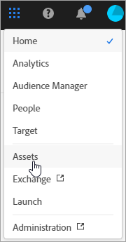
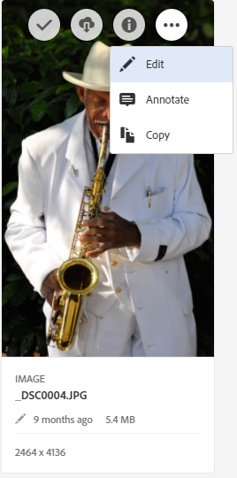

# Översikt över Experience Cloud Assets

Experience Cloud Assets utgör ett enda centralt arkiv av marknadsföringsmaterial som ni kan dela mellan olika lösningar. En resurs är ett digitalt dokument, en bild, en video eller ett ljud (eller en del av ett) som kan ha flera återgivningar och kan ha underresurser (t.ex. lager i en [!DNL Photoshop]-fil, bilder i en [!DNL PowerPoint]-fil, sidor i en PDF-fil, filer i en ZIP-fil).

Tillgångstjänster:

* Resurslagring, hanteringsgränssnitt, inbäddat urvalsgränssnitt (nås via lösningar).
* Integrering med Creative Cloud, Experience Cloud och Experience Cloud.

Genom att använda mediefiler blir det enhetligare och varumärkeskommunikationen effektivare och kortare time-to-market. Ni kan effektivisera arbetsflödena i lösningar:

* **[!DNL Social]**: Publicera på sociala medier, Facebook, Twitter, LinkedIn, Google+
* **[!DNL Target]**: Skapa upplevelser för A/B-tester och multivariata tester.
* **[!DNL Media Optimizer]**: Utveckla annonsenheter i olika kanaler och kampanjer
* **[!DNL Campaign]**: Lägg in resurser i nyhetsbrev och kampanjer via e-post.

I [!UICONTROL Experience Cloud Assets] kan du:

* [Navigera till Experience Cloud Assets](experience-cloud-assets.md#section_3657039DD3524F2AA88753BFF4781125)
* [Öppna verktygsfältet](experience-cloud-assets.md#section_EC2E401D225148818F3753248556BE6B)
* [Redigera resurser](experience-cloud-assets.md#section_CD3C55A9D4574455B94D0955391C8FEC)
* [Sök efter resurser](experience-cloud-assets.md#section_50FE049010B446FC9640AA6A30E5A730)
* [Anteckna resurser](experience-cloud-assets.md#section_67FE1DFAAB744DA5B1CD3AD3CCEABF7A)
* [Visa helskärmsresurser och zoomning](experience-cloud-assets.md#section_A9F50D7D6BE341A2AB8244A4E42A4EF7)
* [Visa tillgångsegenskaper](experience-cloud-assets.md#section_FED28711DAB14E1BBEEA7CA890EE9573)
* [Kör användningsrapporter](experience-cloud-assets.md#section_15D782FFB8D74CF4A735116CC03AD902)
* [Resursdelning med Experience Manager](experience-cloud-assets.md#section_45C1B72F4D274F54BC6CCB64D2580AC5)

## Navigera till Experience Cloud Assets {#section_3657039DD3524F2AA88753BFF4781125}

## Öppna verktygsfältet {#section_EC2E401D225148818F3753248556BE6B}

Navigera till en resurs (eller resurskatalog) och välj sedan **[!UICONTROL Select]**.

Verktygsfältet ger snabb åtkomst till funktioner som sökning, tidslinje, återgivning, redigering, anteckning och hämtning.

## Redigera resurser {#section_CD3C55A9D4574455B94D0955391C8FEC}

Redigering av en mediefil möjliggör bland annat följande funktioner:

* Beskär
* Rotera
* Vänd

## Sök efter resurser {#section_50FE049010B446FC9640AA6A30E5A730}

Du kan söka efter nyckelord, filtyp, storlek, senaste ändring, publiceringsstatus, orientering och format.

## Anteckna resurser {#section_67FE1DFAAB744DA5B1CD3AD3CCEABF7A}

Välj **[!UICONTROL Annotate]** genom att rita cirklar eller pilar på en bild och anteckna resursen för granskning av medarbetare.

## Visa resurser i helskärmsläge och zooma {#section_A9F50D7D6BE341A2AB8244A4E42A4EF7}

Välj **[!UICONTROL Views]** > **[!UICONTROL Image]** om du vill visa hela resursbilden och aktivera zoomning.

## Visa resursegenskaper {#section_FED28711DAB14E1BBEEA7CA890EE9573}

Välj mellan kortvyn med egenskaper, listvy och kolumnvy för att enklare hitta resurser.

Välj **[!UICONTROL Views]** > **[!UICONTROL Properties]** om du vill visa en resurs egenskaper:

## Kör användningsrapporter {#section_15D782FFB8D74CF4A735116CC03AD902}

Se antalet användare, använt lagringsutrymme och totalt antal resurser.

Välj **[!UICONTROL Tools]** > **[!UICONTROL Reports]** > **[!UICONTROL Usage Report]**

