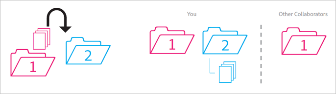
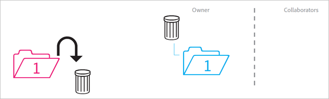

# Beteende för delade mappar

Regler för hur delade mappar fungerar när de flyttas, tas bort och återställs.

>[!NOTE]
>
>Delade Experience Cloud-mappar och -resurser speglas till skrivbordet i Creative Cloud i en 1:1-relation. Om en Experience Cloud-användare ändrar en mapp (tar bort, lägger till eller tar bort delning) speglas åtgärden i Creative Cloud på skrivbordet och webben. Om en mapp inte delas tas mappen och resurserna bort från den lokala datorn. När delningen har tagits bort flyttas mappen och dess innehåll till papperskorgen på den lokala datorn, där du kan återställa dem manuellt till datorn.

## Odelad mapp i delad mapp {#section_A9BAC1A244A246A984AC62660E61E0C0}

Du flyttar en mapp som inte delas till en delad mapp:

**Resultat**: Båda mapparna delas.

## Delad mapp i odelad mapp {#section_8BA83001DCEC4CF084B980C4A660F59A}

Du flyttar en delad mapp till en mapp som inte delas.

**Resultat**: Mappen som inte delas förblir odelad. Den delade mappen förblir delad.

## Innehåll från odelad mapp till delad mapp {#section_2941ED0DC52E4573AC1AB4C22313DD8E}

Du flyttar innehåll från en mapp som inte delas till en delad mapp.

**Resultat:** Innehållet delas nu och alla medarbetare kan se det. Lagringsutrymmet ökar med innehållets storlek.

## Arkiverat och tagit bort delat innehåll {#section_5210D5F4943A44D0BA675D8EB4EAE20F}

Du arkiverar eller tar bort innehåll som finns i en delad mapp.

**Resultat:** Innehållet arkiveras för mappens ägare. Medarbetare som inte äger innehållet kan inte längre komma åt det.

## Ägt delat innehåll till en odelad mapp {#section_3810A364B67E4B8C9CA244BC52BF91BB}

Du flyttar innehåll från en delad mapp som du äger till en mapp som inte delas.

**Resultat:** Innehållet delas inte nu. Medarbetarna i den delade mappen har inte längre åtkomst till innehållet.

## Innehåll som inte delas till en odelad mapp {#section_310766EBF0DC4C0BB4AB3E8A4DAEBE07}

Du flyttar innehåll från en delad mapp som ägs av någon annan till en mapp som inte delas.

**Resultat:** Innehållet visas i den odelade mappen och tas bort från den delade mappen. Medarbetarna i den delade mappen har inte längre åtkomst till innehållet. Innehållet arkiveras för ägaren av den delade mappen.

Ägare och redigerare kan flytta innehåll som de inte äger, men tittarna kan inte det. Om ägare och redigerare flyttar innehåll är det inte tillgängligt i en delad mapp för någon användare.

## Arkiverad eller borttagen ägd mapp {#section_B314B13512A5409C87C49DFDB7602E14}

Du arkiverar (via webben) eller tar bort (via skrivbordet) en delad mapp som du äger.

**Resultat:** Mappen delas inte och arkiveras sedan. Medarbetarna har inte längre åtkomst till mappen.

## Delad mapp i en annan delad mapp {#section_0A3F203D048D4D1586E9850DC92C51E9}

Du flyttar en delad mapp som du äger till en annan delad mapp som du kanske äger eller inte äger.

**Resultat:** När mappen flyttas till Mapp 2 delas den med de nya medarbetarna.

## Delat innehåll till en annan delad mapp {#section_69F6C312792A4CD2831BD14A340F850E}

Du flyttar innehåll från en delad mapp till en annan delad mapp.

**Resultat:** Innehållet visas i Mapp 2 och delas nu med nya medarbetare. Innehållet tas bort från Mapp 1 och ägaren ser det som arkiverat, medan andra medarbetare inte längre har tillgång till det.

## Återställt innehåll från arkivet {#section_DEA990B3581741F89FBB81D18C2AB449}

Du återställer innehåll från ett arkiv som tillhör en delad mapp. Du ägde innehållet när det arkiverades.

**Resultat:** Innehållet återställs till den delade mappen och alla medarbetare kan komma åt det igen. Om den delade mappen inte längre finns, placeras innehållet i en odelad kopia av dess ursprungliga överordnade mapp(ar).
