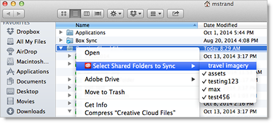

# Inaktivera synkronisering av delade mappar

Så här inaktiverar du synkroniseringen av delade Experience Cloud-mappar i Creative Cloud Files-mappen.

>[!NOTE]
>
>Du kan endast desynkronisera mappar som du äger.

 <b>Windows</b> 

1. Öppna Utforskaren.

1. Under Favoriter högerklickar du på **[!UICONTROL Creative Cloud Files]** mappen och sedan på **[!UICONTROL Select Shared Folders to Sync]**.

   

1. Avmarkera en mapp som du inte vill synkronisera.

 <b>Mac OS</b> 

1. Öppna ett Finder-fönster.

1. Navigera till din användarmapp.

1. Ctrl-klicka på **[!UICONTROL Creative Cloud Files]** och klicka sedan på **[!UICONTROL Select shared folders to sync]**.

   

1. Avmarkera en mapp som du inte vill synkronisera.

   Synkroniserade mappar har en bockmarkering bredvid mappnamnet.