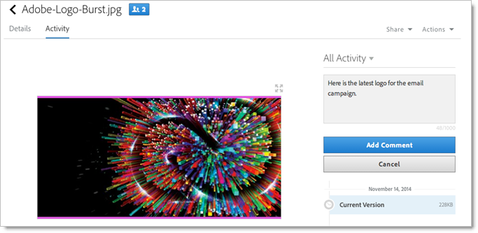

# Dela en Experience Cloud-resursmapp

Dela en resursmapp för Experience Cloud med Creative Cloud-användare.

1. Klicka på **[!UICONTROL Share to Creative Cloud]** i en resursmapp.

   
1. På sidan Dela till Creative Cloud söker du efter användaren och klickar sedan på **[!UICONTROL Add]**.

   

1. Klicka på **[!UICONTROL Share]**.
1. Starta skrivbordet [!DNL Creative Cloud] (eller navigera till sidan [!UICONTROL Creative Cloud Files] i en webbläsare) och leta efter meddelandet om begäran.

   
1. Öppna begäran och klicka sedan på **[!UICONTROL Accept]**.

   
1. Klicka på **[!UICONTROL Open Folder]** (eller **[!UICONTROL View on Web]**) om du vill komma åt mappinnehållet.

   
1. Fortsätt genom att lägga till kommentarer i den delade resursen:

   I Creative Cloud kan du klicka i en bild och sedan klicka på **[!UICONTROL Activity]** för att lägga till en kommentar i bilden. Kommentarerna synkroniseras med resurserna i [!DNL Creative Cloud] och [!DNL Experience Cloud].

   

   Klicka på en bild i Experience Cloud och klicka sedan på tidslinjeikonen för att lägga till en kommentar i bilden. Kommentarerna synkroniseras på resurserna i Creative Cloud och Experience Cloud.

   

1. Om du vill ta bort delningen av en mapp klickar du på **[!UICONTROL Share Using Creative Cloud]** (liknande [Steg 3](../experience-cloud-assets/t-share-creative-cloud.md#step_BA17CFA185284641A9B878BA29551996)), tar bort användare genom att klicka på X och sedan på **[!UICONTROL Share]**.

När du har tagit bort alla Creative Cloud-användare delas inte mappen och Creative Cloud-användare har inte längre åtkomst.

Fler sätt att använda en delad resurs är:

* Använd resurser i [!UICONTROL Asset Selector] i [!DNL Adobe Social] för sociala inlägg.
* Läs in eller byt resurser i [offertbiblioteket](https://docs.adobe.com/help/en/target/using/experiences/offers/manage-content.html) i [!DNL Adobe Target] för bilder i aktiviteter.

När du har delat en mapp med Creative Cloud visas Creative Cloud logotypen i mappen.

Relaterad hjälp:

* [Hjälp om Creative Cloud - Hantera och synkronisera filer](https://helpx.adobe.com/creative-cloud/help/sync-files.html)
* [Hjälp om Creative Cloud - Samarbeta med andra](https://helpx.adobe.com/creative-cloud/help/collaboration.html)
* [Hjälp om Creative Cloud - Vanliga frågor om samarbete](https://helpx.adobe.com/creative-cloud/help/collaboration-faq.html)
