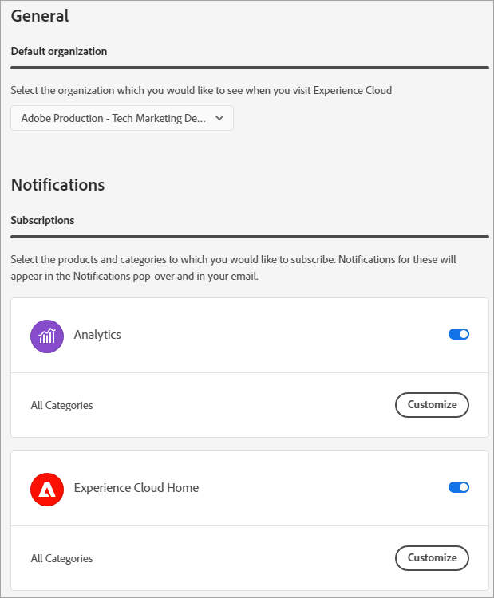

# Kontoinställningar och meddelanden {#preferences}

Inställningarna för Experience Cloud omfattar meddelanden, prenumerationer och varningar. På kontoinställningsmenyn kan du:

* Ange ett mörkt tema (alla program stöder inte det här temat)
* Sök efter [organisationer](../administration/organizations.md)
* Logga ut
* Konfigurera kontoinställningar, meddelanden och prenumerationer

Om du vill hantera inställningar väljer du **[!UICONTROL Preferences]** på din kontomeny .

På [!UICONTROL Experience Cloud preferences] kan du konfigurera följande funktioner:

| Funktion | Beskrivning |
|--- |--- |
| [Standardorganisation](../administration/organizations.md) | Välj den organisation som du vill se när du startar Experience Cloud. |
| [!UICONTROL Product data collection] | Välj vilka tekniker Adobe kan använda för att samla in data om hur du använder dina Adobe-produkter. |
| [!UICONTROL Personalized learning recommendations and promotions] | Välj var du vill få [personlig hjälp](personalized-learning.md) för dina Adobe-produkter. Den här hjälpen finns tillgänglig via e-post, i programmet och i Experience League Communities. |
| [!UICONTROL Subscriptions] | Välj de produkter och kategorier som du vill prenumerera på. Meddelanden i [!UICONTROL Notifications]-porten och i ditt e-postmeddelande. |
| [!UICONTROL Priority] | Välj de kategorier som du vill ska ha hög prioritet. Dessa kategorier är markerade med en [!UICONTROL High]-tagg och kan konfigureras för leverans som varningar. |
| [!UICONTROL Alerts] | Välj de meddelanden som du vill visa aviseringar för i webbläsaren. Varningar visas i fönstrets övre högra hörn under några sekunder. |
| E-post | Ange hur ofta du vill få e-postmeddelanden. (Inte skickat, direkt, dagligen eller veckovis.) |

{style="table-layout:auto"}

## Meddelanden {#notifications}

Välj **[!UICONTROL Notifications]** om du vill få meddelanden om relevanta och åtgärdbara uppdateringar, inklusive produktreleaser, underhållsmeddelanden, delade objekt och godkännandebegäranden.

## Språkstöd i Experience Cloud {#languages}

Experience Cloud har stöd för de språk som varje användare föredrar, enligt inställningarna för ditt Adobe-användarkonto. Språk som stöds är:

* Kinesiska
* Engelska
* Franska
* Tyska
* Italienska
* Japanska
* Koreanska
* Portugisiska
* Spanska
* Taiwanesiska

Alla programteam arbetar för globalt språkstöd, men alla program finns inte på alla språk som anges ovan. Om ditt primära språk inte stöds i ett Experience Cloud-program kan du även ange ett sekundärt språk som standard till när det är tillämpligt. Detta kan du göra i [Experience Cloud-användarinställningarna](https://experience.adobe.com/preferences).