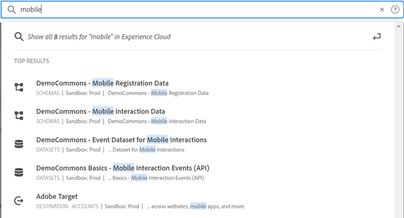
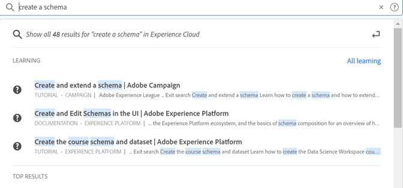

# [!UICONTROL Unified Search] för objekt och entiteter {#globally-search}

Med sökfunktionen [!UICONTROL Unified Search] kan du söka efter sökbara affärsobjekt eller entiteter på ett smidigt och enhetligt sätt med ett enda klick. Den här sökningen använder även dina nyligen använda objekt.

## Åtkomst till enhetlig sökning

Enhetlig sökning är tillgänglig på alla sidor i sidhuvudet i Experience Cloud överst på sidan. Du kan också använda kortkommandot `command /` eller `ctrl /` för att komma åt sökningen.

Den här funktionen är endast tillgänglig för produkter som stöds och som för närvarande är:

* Experience Platform (AEP)
* Journey Optimizer (AJO)

När mer innehåll indexeras läggs den här funktionen till i relevanta program.

## Sökbara objekt och fält

När du skriver kommer de matchande toppresultaten från de objekt som du har åtkomst till att visa.

Våra algoritmer visar de mest relevanta posterna först. Vilken ordning du väljer beror på flera faktorer, till exempel:

Din förmåga och dina objektbehörigheter
Matchande procent
Om det finns en exakt matchning

Sökbara affärsobjekt:

* Segment (namn, beskrivning, ID)
* Schema (namn, beskrivning, ID)
* Datauppsättningar (namn, beskrivning, ID)
* Källor (namn, beskrivning, ID)
* Destinationer (namn, beskrivning, ID)
* Frågor (namn, beskrivning, ID)
* Meddelanden (namn, beskrivning, ID)
* Erbjudanden (namn, beskrivning, ID)
* Komponenter (namn, beskrivning, ID)
* Resor (namn, beskrivning, ID)

Om ett nyckelord matchar en navigeringssida kan du få snabb åtkomst till länken till exempeldatauppsättningar för navigeringssidan. I det övre resultatavsnittet visas de 30 viktigaste resultaten.

Du hittar även hjälpartiklar från Experience League och Communities. Naturliga språkfrågor stöds.

_Så här skapar du till exempel ett schema_ som ger resultat från Experience League under _[!UICONTROL Learning]_:

Sökalgoritmer visar först de mest relevanta posterna. Vilken ordning du väljer beror på flera faktorer, till exempel:

* Användarbehörigheter för att komma åt objekt
* Matchande procent
* Exakta matchningar
* Avsnittet _[!UICONTROL Top Results]_&#x200B;visar de 30 viktigaste resultaten.

Förfina sökningen genom att klicka på något av följande:

* **[!UICONTROL All Learning]**: Öppnar sökningen i Experience League.
* **[!UICONTROL Show all...]**: Gör att du kan förfina och filtrera resultaten ytterligare.

## Enhetliga sökfunktioner

Följande funktioner är tillgängliga i Unified Search.

| Funktion | Beskrivning |
| ------- | ------- |
| Stöd för globala språk | Global sökning tolkar frågor och ger resultat för tyska, spanska, franska, italienska, japanska, koreanska, portugisiska och kinesiska. |
| Typo-tolerans | Enhetlig sökning ger robust typotolerans med avancerade algoritmer. Dessa algoritmer beräknar redigeringar och ger lämpliga resultat. |
| Markering | Söksvaret markerar det matchande nyckelordet från sökfrågan så att du enkelt kan hitta det avsnitt och de ord som matchar frågan. Markering fungerar även för felstavade ord. |
| Fragment | I söksvaret kan du se ett utdrag av resultatet. Kodavsnitt returnerar matchande ord och en del innehåll runt de matchande nyckelorden. |
| Stoppord | Vissa vanliga ord på engelska definieras som _stoppord_. Om stoppord ingår i sökfrågan ges mindre vikt.  Stoppord inkluderar: _a, an, och, are, as, at, men, by, for, for, in, is, it, no, not, of, or, so, that,, their, then, this,, to, was, will, with_.  Stoppord stöds inte i andra globala språk. |
| Naturliga språkfrågor | När du söker efter en hjälpartiklar eller en diskussion från Experience League Communities kan du skriva din fråga på ett naturligt språk och få svaret. Exempelsökning:&quot;Hur skapar jag ett schema?&quot; |
| Exakt sökning inom citattecken | Du kan göra en exakt sökning genom att använda citattecken i frågan. Ingen typokorrigering görs på exakta matchningsfrågor. Exempel:&quot;Luma Journey 2022&quot;. |
| Filter | Du kan använda filter som _Objekttyp_ och andra objektspecifika filter i popup-fönstret för fullständiga sökresultat. När du trycker på Retur efter att du har kopplat sökfrågan öppnas ett popup-fönster med hela sidan som innehåller filtren. |

{style="table-layout:auto"}

## Hittar du den inte?

Testa följande tips:

* Ange ett mer specifikt sökord
* Kontrollera stavningen
* Försök skriva hela söktermen
* Se till att du har behörighet till objekt som du söker efter
