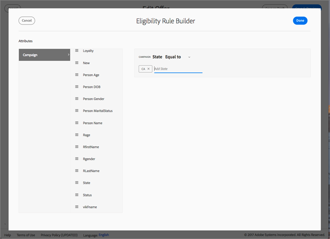
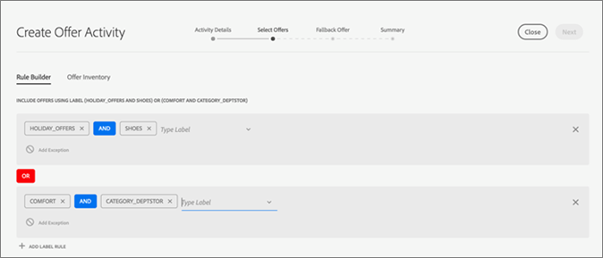

# Campaign{#campaign}

Lär dig hur du använder erbjudanden och delar fält i Adobe Campaign Standard.

När du har skapat minst ett reserverbjudande och ett allmänt erbjudande kan du skapa en erbjudandeaktivitet med ett e-postmeddelande i Campaign Standard. En erbjudandeaktivitet kan bara skapas i en vanlig e-postkampanj. Det går inte att lägga till det i en transaktionell e-postkampanj (t.ex. ett återkommande e-postmeddelande som utlöses av en händelse, t.ex. ett e-postmeddelande om att kunden har lämnat en kundvagn).

En erbjudandeaktivitet uppmanar dig att välja en grupp erbjudanden och ett reserverbjudande som kan visas på en plats i en e-postmall. Det bästa erbjudandet som kan användas är bland de erbjudanden som gäller vid e-postförberedelsen, baserat på uppgifter om placering, datum, erbjudandestatus och kundprofil.

## Dela attribut från Campaign till [!UICONTROL Offer Management]{#task_4DFA9A20D7B04E1F9AFF4774D67B6EBC}

När du skapar ett erbjudande i [!UICONTROL Offer Management]kan du ange regler för behörighet som begränsar vilka profiler som kan ta emot vissa erbjudanden. Dessa regler för behörighet kan anges baserat på attribut (eller fält) som finns i Campaign-profilen. Dessa fält måste delas från Campaign innan de visas i [!UICONTROL Offer Management] regelbyggaren.

>[!NOTE]
>
>Om du vill dela attribut måste du ha administratörsbehörighet i Campaign.

1. Klicka **[!UICONTROL Adobe Campaign]** för att komma åt navigeringen.
1. Navigera till **[!UICONTROL Administration]** > **[!UICONTROL Instance Settings]** > **[!UICONTROL Offer Management]** och klicka **[!UICONTROL Attributes]**.

   På den här sidan visas attribut som redan har delats. Du kan redigera eller ta bort dessa attribut.

   

   >[!NOTE]
   >
   >Om ett attribut används av [!UICONTROL Offer Management] i en berättiganderegel kan det inte tas bort.

1. Klicka på **[!UICONTROL Create]**.

1. Klicka på mappikonen för att definiera Campaign-datakällan och markera elementet som du vill dela.

   

1. Välj en måldataetikett.

   Det här är namnet på attributet som ska visas i redigeringsregelbyggaren i [!UICONTROL Offer Management].

1. Klicka på **[!UICONTROL Create]**.

   Attributet visas i verktyget för [!UICONTROL Offer Management] berättiganderegler när erbjudanden skapas och redigeras.

   

## Skapa en erbjudandeaktivitet {#task_F63ADDA52BD949779DB491E4D56E664E}

Infoga en erbjudandeaktivitet i valfri bild eller textblock i en e-postmall i Campaign Standard.

1. Om du vill infoga en erbjudandeaktivitet på en bildplats klickar du en gång på bilden för att öppna ikonen Infoga erbjudande.

   

1. (Alternativt): Om du vill infoga en erbjudandeaktivitet i ett textblock klickar du två gånger på textblocket för att visa ikonen Infoga erbjudande.

1. Fyll i informationen på [!UICONTROL Activity Details] fliken på [!UICONTROL Create Offer Activity] skärmen:

   | Fält | Beskrivning |
   |---|---|
   | Aktivitetsnamn | Ge aktiviteten ett namn. Du kan inte ange ett aktivitetsnamn som redan har använts i en annan erbjudandeaktivitet. |
   | Placement | Välj den placering som ska användas för den här platsen. Detta är för att säkerställa att endast erbjudanden med en innehållsrepresentation som matchar placeringen skickas till en användare. Endast erbjudanden med den här placeringen visas i erbjudandelistorna under resten av aktivitetsskapandet. |

1. Välj de erbjudanden du vill inkludera i aktiviteten på fliken [!UICONTROL Select Offers] .

   Du kan välja grupper med erbjudanden med hjälp av etiketter eller enskilda erbjudanden, en i taget.

   * **Välja grupper av erbjudanden med hjälp av etiketter:**

      Om du vill välja grupper med erbjudanden med hjälp av etiketter klickar du på **[!UICONTROL Rule Builder]** fliken och sedan på **[!UICONTROL Add Label Rule]**. Om du vill skapa regler för att avgöra vilka erbjudanden som ska inkluderas i erbjudandeaktiviteten väljer du etiketten. En _AND_ -operator visas mellan etiketterna. Om du vill ändra operatorn från _AND_ till _OR_ klickar du på operatorn.

      

   * **Markera enskilda erbjudanden:**

      Klicka på **[!UICONTROL Offer Inventory]** fliken för att välja enskilda erbjudanden. En användare kan söka i erbjudandelistan efter erbjudandets namn, erbjudande-ID eller etiketter som har lagts till i erbjudandet.

      Klicka på plustecknet för att lägga till erbjudandena i avsnittet Valda erbjudanden i listan.

      

      För att ett erbjudande ska vara tillgängligt i både regelbyggaren och ert erbjudandelager måste det

   * Matcha dagens datum.
   * Har status godkänd.
   * Ha en innehållsrepresentation med en placering som matchar den som valdes i steg 1.

      >[!NOTE]
      >
      >Erbjudandena på fliken Erbjudandelager filtreras endast efter placering och godkännandestatus. De har inte filtrerats så att de matchar målvillkoren för e-postmeddelandet i Adobe Campaign.

1. Välj ett reserverbjudande på [!UICONTROL Fallback Offer] fliken. Reserverbjudandet skickas endast till en kund om de inte är berättigade till andra erbjudanden. Du kan bara välja ett reserverbjudande i listan.
1. Visa sammanfattningen av din erbjudandeaktivitet och klicka på **[!UICONTROL Done]**.

   Det bästa erbjudandet för varje användare bestäms vid e-postförberedelsen genom att utvärdera följande:

* **Placeringskontroll:** Alla erbjudanden måste ha en innehållsrepresentation som matchar den valda placeringen som en del av erbjudandeaktiviteten. Om en placering för ett erbjudande tas bort mellan skapandetid för en aktivitet och förberedelsetid (om tiden är längre än tre minuter) beaktas inte erbjudandet.
* **Datumkontroll:** Alla erbjudanden måste vara giltiga för aktuellt datum (detta är _inte_ erbjudandets sändningsdatum). Datumet när du förbereder e-postkampanjen är det datum som avgör vilket erbjudande som ska användas. Om du t.ex. förbereder en e-postkampanj den 17 maj 2017 och ett av de valda erbjudandena inte är giltigt förrän 17 juni 2017 får du inte något erbjudande.

* **Kontroll av kvalificeringsregel:** Alla erbjudanden måste uppfylla [reglerna](offers.md)för behörighet.

* **Prioritetskontroll:** Om en användare är berättigad till flera erbjudanden [!UICONTROL Offer Management] använder prioriteten som anges av användaren för att avgöra vilket erbjudande som ska visas för varje användare.

   Ditt e-postmeddelande är nu klart att skickas. Markera [!UICONTROL Reports] fliken på [!DNL Adobe Campaign] hemsidan för att se hur dina erbjudanden har fungerat.

   Mer information om hur du använder Adobe Campaign finns i följande handböcker:

* [Skapa ett e-postmeddelande](https://docs.campaign.adobe.com/doc/standard/en/CHA_Email_messages_Creating_an_email.html)
* [Skicka ett e-postmeddelande](https://docs.adobe.com/content/help/en/campaign-standard/using/testing-and-sending/about-sending-messages-with-campaign.html)
* [Om dynamiska rapporter](https://docs.campaign.adobe.com/doc/standard/en/RPT_About_reporting_About_dynamic_reports.html)

## Erbjudanderapporter

Adobe Campaign har tre olika erbjudandedimensioner (erbjudande, erbjudandeaktivitet, erbjudandeplacering) och ett mätvärde (erbjudandeklickningar) som gör att ni kan övervaka era erbjudanden och mäta deras påverkan. Du kan visa rapporter på fliken Rapporter i Adobe Campaign Standard. Du kan skapa din rapport och dra och släppa olika dimensioner av erbjudandet i rapportpanelen för att börja filtrera dina data.

Mer information om hur du skapar dynamiska rapporter i Campaign finns i [Om dynamiska rapporter](https://docs.campaign.adobe.com/doc/standard/en/RPT_About_reporting_About_dynamic_reports.html).