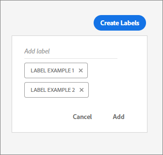

# Etiketter{#labels}

Skapa och hantera etiketter som du kan använda för att ordna erbjudanden.

## Etiketter {#topic_65F3A7091A7D4F61B1FEFFEC6DE107C9}

Skapa och hantera etiketter som du kan använda för att ordna erbjudanden.

Du kan lägga till en eller flera etiketter till varje erbjudande som skapas. Etiketter har två syften:

* Se till att era erbjudanden är välorganiserade. Du kan till exempel märka dina erbjudanden på den svarta fredagen med etiketten Black Friday. Du kan sedan använda sökfunktionen på huvudsidan för att enkelt hitta alla erbjudanden med den etiketten.
* Välj flera erbjudanden samtidigt när du skapar en erbjudandeaktivitet. När du infogar en erbjudandeaktivitet i en e-postkampanj kan du inkludera erbjudanden baserat på deras etikett. I stället för att välja erbjudanden individuellt kan du inkludera alla erbjudanden med etiketten &quot;Black Friday&quot;.

På fliken Etiketter kan du skapa, redigera och hantera etiketter.

## Skapa en etikett {#task_53EAF61281BB47D4B64ECF5F44CECA69}

1. On the [!UICONTROL Labels] tab , click **[!UICONTROL Create Labels]**.
1. Skriv ett etikettnamn och tryck på Retur.

   

1. Klicka på **[!UICONTROL Add]**.

   Du kan tilldela etiketter till ett erbjudande när du skapar erbjudandet eller när du redigerar ett befintligt erbjudande.