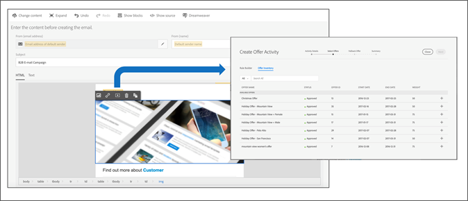

# Arbetsflöde för erbjudandehantering{#offer-management-workflow}

Lär dig det övergripande arbetsflödet för [!UICONTROL Offer Management]bland annat att skapa och erbjuda, lägga in erbjudandeaktiviteter och visa rapporter.

## Steg 1 - Bestäm var i e-postmallarna ni behöver personaliserade erbjudanden {#section_F184E589428B403EA8EB921BF230CF87}

Identifiera i vilka e-postkampanjer ni vill infoga personaliserade erbjudanden. Bestäm vilka platser i din e-postmall som du vill infoga erbjudandena från. Du kanske vill ändra produkterbjudandet baserat på kundens bransch eller persona, ändra meddelandet baserat på samma kriterier och variera bilden baserat på kundens geografiska läge.

## Steg 2 - Bestäm vilka attribut från Campaign du vill ha som mål och dela dem med Erbjudandehantering {#section_1461F1FAC0B943E5BBDED6B3B00E9D5C}

När du skapar ett erbjudande i [!UICONTROL Offer Management]kan du ange regler för behörighet som begränsar vilka profiler som kan ta emot vissa erbjudanden. Dessa regler för behörighet kan anges baserat på attribut (eller fält) som finns i Adobe Campaign. De här fälten måste delas från Campaign av en användare på administratörsnivå innan de visas i [!UICONTROL Offer Management] regelbyggaren.

Information om hur du delar dessa attribut finns i [Dela attribut från Campaign till Erbjudandehantering](campaign.md#task_4DFA9A20D7B04E1F9AFF4774D67B6EBC).

## Steg 3 - Ange obligatoriska placeringar i [!UICONTROL Offer Management]{#section_71619756A86F4DB58B8200D8A1CE1B87}

En placering hjälper er att se till att rätt erbjudandeinnehåll visas på rätt plats i e-postmallen. När du lägger till innehåll i ett erbjudande blir du ombedd att välja en placering där innehållet kan visas.

Du kan ha flera platser med samma placering. I följande exempel finns det två placeringar för två bilder med olika storlek och en placering för texten som visas högst upp och längst ned i mallen.

När du har bestämt vilka placeringar du behöver kan du lägga till dem på [!UICONTROL Placement] fliken.

## Steg 4 - Skapa dina erbjudanden {#section_C4F9732B0596425EB0BD5AE76E4BA6EF}

Skapa de erbjudanden du vill använda i din e-postkampanj. Det finns data och innehåll som kan läggas till i erbjudandet för att avgöra vilket som är det bästa erbjudandet att leverera och vilket innehåll som ska visas. När du skapar en innehållsrepresentation associerar du den med någon av de placeringar som är definierade i [Placeringar](placements.md). När du har skapat och skickat in ett erbjudande blir det tillgängligt för användning i en erbjudandeaktivitet.

## Steg 5 - Skapa en e-postkampanj och infoga en erbjudandeaktivitet {#section_6FD36404759B4C6E9FD3A65ACABB26C8}

Nu när du har skapat dina erbjudanden kan du använda dem i en e-postkampanj. I innehållsredigeraren kan du välja ett block och infoga en erbjudandeaktivitet. Med en erbjudandeaktivitet kan ni välja en grupp erbjudanden från ert erbjudandelager, från vilka beslutsmotorn avgör vilket erbjudande som är bäst för varje användare.

## Steg 6 - Förbered och skicka din e-postkampanj {#section_EDD8EA4696664130A678D7C4483DA806}

När du nu förbereder din e-postkampanj kommer att [!UICONTROL Offer Management] fastställa det bästa erbjudandet att betjäna varje besökare baserat på aktuellt datum, profilattribut och prioritet. Det avgör också om det finns en innehållsrepresentation tillgänglig för platsens placering.

I följande exempel antar vi att du har konfigurerat en e-postkampanj med en erbjudandeaktivitet som innehåller 3 erbjudanden (A, B, C). Du kan se vilket erbjudande som ska användas på någon av platserna i vårt e-postmeddelande. Under beredningen [!UICONTROL Offer Management] kommer

1. Analysera aktuellt datum, profildata för varje användare och prioritet.
1. Jämför informationen med informationen om erbjudandena.
1. Bestäm det bästa erbjudandet.

## Steg 7 - Visa rapporter {#section_2104BAACAE154DE29B6EEB967C46F226}

Du kan visa en rapport om vilka erbjudanden som har erbjudits och hur de har utförts i en erbjudandeaktivitet. Du kan visa den här rapporten genom att välja fliken Rapporter på startsidan för Adobe Campaign Standard.
