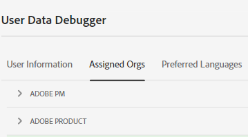
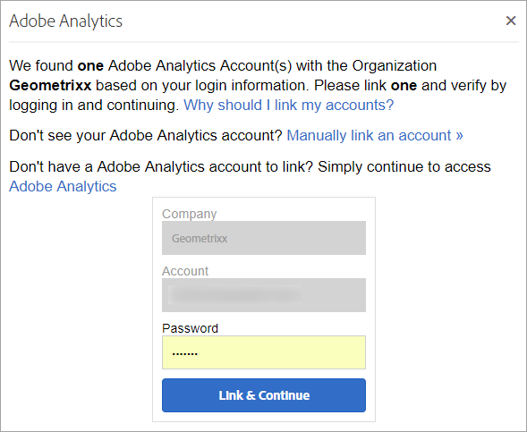

# Organisationer i Experience Cloud

Läs om hur du hanterar och byter företag i Experience Cloud.

## Identifiera er organisation {#concept_384D169B0B724B799D573B8ECB5C39BF}

An *organisation* (Org ID) är den enhet som gör det möjligt för en administratör att konfigurera grupper och användare samt att styra enkel inloggning i Experience Cloud. Organisationen fungerar som ett inloggningsföretag som omfattar alla produkter och program i Experience Cloud. Oftast är en organisation ditt företagsnamn. Ett företag kan dock ha många organisationer.

Kontrollera att du har loggat in på rätt organisation genom att klicka på din profilavatar för att visa organisationsnamnet. Om du har tillgång till mer än en organisation kan du även visa och växla till en annan organisation direkt i sidhuvudsfältet.

Om din organisation använder Federated ID:n kan du med Experience Cloud logga in med din organisations enkla inloggning utan att behöva ange din e-postadress och ditt lösenord. Lägg till `#/sso:@domain` till Experience Cloud URL (`https://experience.adobe.com`) för att utföra den här uppgiften.

För en organisation med Federated ID och domänen `adobecustomer.com`, ange URL-länken till `https://experience.adobe.com/#/sso:@adobecustomer.com`. Du kan också gå direkt till ett specifikt program genom att skapa ett bokmärke för den här URL:en, som bifogas med programsökvägen. (Exempel: för Adobe Analytics `https://experience.adobe.com/#/sso:@adobecustomer.com/analytics`.)

## Visa ditt organisations-ID {#concept_EA8AEE5B02CF46ACBDAD6A8508646255}

Du kan hitta ditt tilldelade organisations-ID i supportsyfte. Du kan verifiera att du är i rätt organisation, eller växla mellan organisationer, med **[!UICONTROL Organization]** -menyn.

Organisations-ID är det ID som är kopplat till ditt tilldelade Experience Cloud-företag. Detta ID är en 24 tecken lång alfanumerisk sträng, följt av (och måste innehålla) `@AdobeOrg`.

Du kan visa ditt organisations-ID tillsammans med annan kontoinformation med hjälp av ett kortkommando **Ctrl+i** från vilken sida som helst på `https://experience.adobe.com`.

**Så här visar du ditt organisations-ID**

1. I [Experience Cloud](https://experience.adobe.com), tryck **Ctrl+i** på tangentbordet.

   

1. Under **[!UICONTROL User Information]**, sök efter **[!UICONTROL Current Org ID]** och du ser ditt företags-ID.

   Administratörer kan även logga in på Admin Console (navigera till [https://adminconsole.adobe.com](https://adminconsole.adobe.com)) och visa ditt organisations-ID i URL:en.

   I följande URL:

   `https://adminconsole.adobe.com/C538193582390300A495CC9@AdobeOrg/overview`

   ID:

   `C538193582390300A495CC9@AdobeOrg`

## Länka ett programkonto till en Adobe ID {#task_FD389E78640848919E247AC5E95B8369}

Administratörer i Experience Cloud ger vanligtvis tillgång till program och tjänster. I sällsynta fall kan du länka programinloggningsuppgifter till en Adobe ID.

1. Följ stegen i din e-postinbjudan till Experience Cloud.
1. Logga in med ditt Adobe ID eller Enterprise ID.
1. Välj programväljaren. ( ).

   

   De program som du har åtkomst till är färgade.
1. Välj önskat program.

   

   Den här typen av meddelande visas om du tillhör rätt grupp (och har behörighet till programmet) men ännu inte har länkat dina kontoinloggningsuppgifter till din Adobe ID.
1. Välj **[!UICONTROL Link Account]** och ange dina uppgifter.

## Ange en standardorganisation och landningssida {#concept_6A191B42A9874A9780882903BA18F071}

Du kan ange vilken standardorganisation och landningssida som ska användas när du loggar in.

Välj **[!UICONTROL Edit Profile]**.

Under Standardsida för organisation och landning kan du anpassa din inloggningsupplevelse.

## Felsöka problem med kontolänkning {#concept_DFCB29A3B4834FC59AA29E0BBA301584}

Hjälp om problem som uppstår vid kontolänkning.

Kontolänkning misslyckas oftast eftersom Adobe ID är länkat till en tidigare användare. När kontolänkningen misslyckas kan du:

* [Kontakta Adobe support](https://experienceleague.adobe.com/?support-solution=General#support).
* Använd standardinloggningen när problemet är löst.
