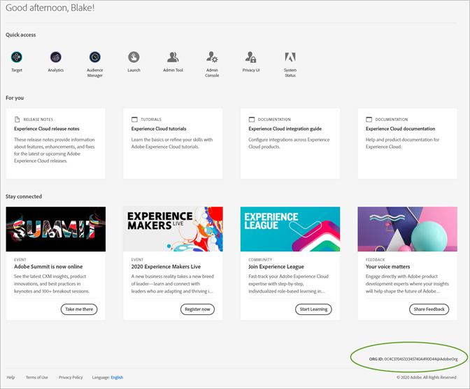

# Organisationer i Experience Cloud

Läs om hur du hanterar och byter företag i Experience Cloud.

## Identifiera er organisation {#concept_384D169B0B724B799D573B8ECB5C39BF}

En *organisation* är den enhet som gör det möjligt för en administratör att konfigurera grupper och användare samt att styra enkel inloggning i Experience Cloud. Organisationen fungerar som ett inloggningsföretag som omfattar alla produkter och lösningar i Experience Cloud. Oftast är en organisation ditt företagsnamn. Ett företag kan dock ha många organisationer.

Kontrollera att du har loggat in på rätt organisation genom att klicka på din profilavatar för att visa organisationsnamnet. Om du har tillgång till mer än en organisation kan du även visa och växla till en annan organisation direkt i sidhuvudsfältet.

Om din organisation använder Federated ID:n kan du med Experience Cloud logga in med din organisations inloggning utan att behöva ange din e-postadress och ditt lösenord. Om du vill göra det lägger du till `#/sso:@domain` i Experience Cloud-URL:en (`https://experience.adobe.com`).

För en organisation med Federated ID och domänen `adobecustomer.com` anger du URL-länken till `https://experience.adobe.com/#/sso:@adobecustomer.com`. Du kan också gå direkt till ett specifikt program genom att skapa ett bokmärke för den här URL:en, som bifogas med programsökvägen. (För Adobe Analytics t.ex. `https://experience.adobe.com/#/sso:@adobecustomer.com/analytics`.)

## Hitta ditt företags-ID {#concept_EA8AEE5B02CF46ACBDAD6A8508646255}

Du kan behöva hitta ditt organisations-ID för support. Du kan verifiera att du är i rätt organisation, eller växla mellan organisationer, via menyn **[!UICONTROL Organization]**.

**Organisations-ID** är det ID som är associerat med ditt tilldelade Experience Cloud-företag. Detta ID är en alfanumerisk sträng med 24 tecken, följt av (och måste innehålla) @AdobeOrg.

Om du vill visa ditt organisations-ID går du till startsidan för Experience Cloud eller väljer ( ) och sedan **[!UICONTROL Administration]**. Du kan hitta organisations-ID:t längst ned på sidan [!UICONTROL Getting Started with the Experience Cloud] eller på sidan [!UICONTROL Administration].

## Länka ett lösningskonto till en Adobe ID {#task_FD389E78640848919E247AC5E95B8369}

Administratörer i Experience Cloud ger oftast tillgång till lösningar och tjänster. I sällsynta fall kan du behöva länka autentiseringsuppgifterna för lösningen till en Adobe ID.

1. Följ stegen i din e-postinbjudan till Experience Cloud.
1. Logga in med ditt Adobe ID eller Enterprise ID.
1. Välj lösningsväljaren. ( ).

   

   De lösningar du har tillgång till är färglagda.
1. Välj önskad lösning.

   

   Den här typen av meddelande visas om du tillhör rätt grupp (och har behörighet till lösningen) men ännu inte har länkat dina kontoinloggningsuppgifter till din Adobe ID.
1. Välj **[!UICONTROL Link Account]** och ange dina autentiseringsuppgifter.

## Ange en standardorganisation och landningssida {#concept_6A191B42A9874A9780882903BA18F071}

Du kan ange vilken standardorganisation och landningssida som ska användas när du loggar in.

Välj **[!UICONTROL Edit Profile]** i din profil.

Under Standardsida för organisation och landning kan du anpassa din inloggningsupplevelse.

## Felsöka problem med kontolänkning {#concept_DFCB29A3B4834FC59AA29E0BBA301584}

Hjälp om problem som uppstår vid kontolänkning.

Kontolänkning misslyckas oftast eftersom Adobe ID är länkat till en tidigare användare. När kontolänkningen misslyckas kan du:

* [Kontakta supporten för](https://experienceleague.adobe.com/?support-solution=General#support) Adobe.
* Använd standardinloggningen när problemet är löst.
