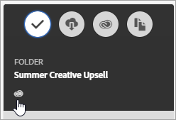

# Dela en resursmapp i Experience Cloud

Dela mappar och resurser mellan Experience Cloud och Creative Cloud. Samarbeta, kommentera i delade resurser och använd dem i Experience Cloud-program som Adobe Target. Den delade mappen måste komma från Experience Cloud.

**Fördelar med delning**

* Effektivisera arbetsflödena för kreativ produktion i gransknings-, godkännande- och publiceringsfasen
* Lägg mindre tid på att hantera filer och versioner på olika platser
* Spåra och hantera kreativa resurser effektivare
* Öka företagets säkerhet
* Dela, spara och skicka enkelt filer mellan kreatörer och marknadsförare

Innan Creative Cloud-användare har tillgång till mediefiler måste de vara tillåtna i Experience Cloud. Se [Hantera Creative Cloud-användare](manage-cc-users.md).

**Så här delar du en Experience Cloud-resursmapp**

1. Klicka på **[!UICONTROL Share to Creative Cloud]** i en resursmapp.

   
1. På sidan Dela till Creative Cloud söker du efter användaren och klickar sedan på **[!UICONTROL Add]**.

   

1. Klicka på **[!UICONTROL Share]**.
1. Starta skrivbordet [!DNL Creative Cloud] (eller navigera till sidan [!UICONTROL Creative Cloud Files] i en webbläsare) och leta efter meddelandet om begäran.

   
1. Öppna förfrågan och klicka sedan på **[!UICONTROL Accept]**.

   
1. Klicka **[!UICONTROL Open Folder]** (eller **[!UICONTROL View on Web]**) om du vill komma åt mappinnehåll.

   
1. Fortsätt genom att lägga till kommentarer i den delade resursen:

   I Creative Cloud kan du markera i en bild och sedan klicka på **[!UICONTROL Activity]** för att lägga till en kommentar i bilden. Kommentarer synkroniseras för resurserna i [!DNL Creative Cloud] och [!DNL Experience Cloud].

   

   I Experience Cloud markerar du en bild och väljer sedan tidslinjeikonen för att lägga till en kommentar i bilden. Kommentarerna synkroniseras med resurserna i Creative Cloud och Experience Cloud.

   

1. Om du vill ta bort delningen av en mapp klickar du på **[!UICONTROL Share Using Creative Cloud]** (ungefär som [Steg 3](share.md)), tar bort användare genom att välja X och sedan klicka på **[!UICONTROL Share]**.

   

   När du har tagit bort alla Creative Cloud-användare delas inte mappen och Creative Cloud-användarna har inte längre åtkomst.

Fler sätt att använda en delad resurs är att läsa in eller byta resurser i [Erbjudandebiblioteket](https://experienceleague.adobe.com/docs/target/using/experiences/offers/manage-content.html) i Adobe Target för bilder i aktiviteter.

När du har delat en mapp med Creative Cloud visas Creative Cloud logotyp i mappen.

Relaterad hjälp:

* [Hjälp om Creative Cloud - Hantera och synkronisera filer](https://helpx.adobe.com/creative-cloud/help/sync-creative-cloud-files.html)
* [Hjälp om Creative Cloud - Samarbeta med andra](https://helpx.adobe.com/creative-cloud/help/collaboration.html)
* [Hjälp om Creative Cloud - Vanliga frågor om Collaboration](https://helpx.adobe.com/creative-cloud/help/collaboration-faq.html)

## Om resursdelning med Adobe Target {#section_B7CD64CAB35D43A4B12957B304072DC9}

När du skapar aktiviteter i [!DNL Adobe Target] kan du använda en delad bildresurs när du byter bilder i [!UICONTROL Offers Library].

Se [Erbjudandebibliotek](https://experienceleague.adobe.com/docs/target/using/experiences/offers/manage-content.html) i hjälpen för [!DNL Target].