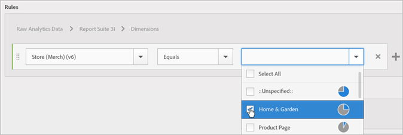

# Skapa en målgrupp

Lär dig hur du använder attributregler för att skapa en målgrupp och definiera en sammansatt målgrupp i Experience Cloud.

Den här artikeln hjälper dig att förstå hur du gör:

* Skapa en målgrupp
* Skapa en regel
* Använd regler för att definiera en sammansatt målgrupp

Följande bild representerar två regler i en sammansatt målgrupp.

Varje cirkel representerar en regel som definierar målgruppsmedlemskap. Besökare som kvalificerar sig som medlemmar i båda målgruppsreglerna överlappar varandra och blir den sammansatta, definierade målgruppen.

>[!NOTE]
>
>Publiken definieras helt efter att datainsamlingen för den angivna perioden har slutförts.

I följande exempel visas hur du skapar regler för en sammansatt målgrupp. Denna målgrupp består av:

* Avsnittet Hem och Garden är härlett från siddata eller råanalysdata.
* Chrome- och Safari-användare som härleds från en [!DNL Adobe Analytics] segment [publicerad](overview.md) till [!DNL Experience Cloud].

  

**Skapa en publik**

1. I [!DNL Experience Cloud], under [!DNL Experience Platform], markera **[!UICONTROL People]** > **[!UICONTROL Audience Library].**
1. På [!UICONTROL Audiences] sida, markera **[!UICONTROL New]**. 

   

1. På [!UICONTROL Create New Audience] anger du en titel och en beskrivning.
1. Under [!UICONTROL Rules]väljer du en attributkälla:

   * **[!UICONTROL Real-Time Analytics Data:]** (eller Raw-data) Detta är attributdata som härleds från Real-Time Analytics bildbegäranden och innehåller data som eVars och events. Du måste välja en rapportserie när du använder den här attributkällan och definiera dimensionen eller händelsen som ska inkluderas. Rapportsvitens urval innehåller den variabelstruktur som används av rapportsviten.
   >[!NOTE]
   >
   >På grund av cachelagring kräver borttagna rapportsviter i Analytics 12 timmar innan borttagningen visas i Experience Cloud.

   * **[!UICONTROL Experience Cloud:]** Attributdata härledda från [!DNL Experience Cloud] Källor. Detta kan till exempel vara data från målgruppssegment som du skapar i [!DNL Analytics]eller data från [!DNL Audience Manager].

1. Definiera målgruppsregler och välj sedan **[!UICONTROL Save].**

>[!NOTE]
>
>Ni bör förstå era implementeringsvariabler när ni definierar målgruppsregler.

Under [!UICONTROL Rules], definierar *`Home & Garden`* attributval:

* **[!UICONTROL Attribute Source:]** Råanalysdata
* **[!UICONTROL Report Suite:]** Report Suite 31
* DIMENSION = **[!UICONTROL Store (Merch) (v6)]** > **[!UICONTROL Equals]** > **[!UICONTROL Home & Garden]**

The *Besökare i Chrome och Safari* är ett målgruppssegment som delas av Analytics:

* **[!UICONTROL Attribute Source:]** Experience Cloud
* **[!UICONTROL Dimension:]** Besökare i Chrome och Safari

Du kan till exempel lägga till en *ELLER* regel för att se alla besökare på en sajt, som Patio &amp; Furniture.

Den resulterande regeln är en definierad målgrupp som omfattar Chrome- och Safari-användare som besökte Home &amp; Garden. Segmentet Patio &amp; Furniture ger ytterligare insikter om alla besökare som besöker den webbplatssektionen.

* **Historisk uppskattning:** (Prickad cirkel) Representerar regler som skapats baserat på [!DNL Analytics] data.
* **Faktisk publik:** (Helfylld cirkel) En regel som har skapats med 30 dagars data från Audience Manager. När data från Audience Manager når 30 dagar blir raden heldragen och representerar faktiska tal.

När datainsamlingen har slutförts för den angivna perioden kombineras cirklarna för att visa en definierad målgrupp.

När målgruppen har sparats är den tillgänglig för andra program. Du kan till exempel inkludera en delad målgrupp i en Adobe Target-aktivitet.
