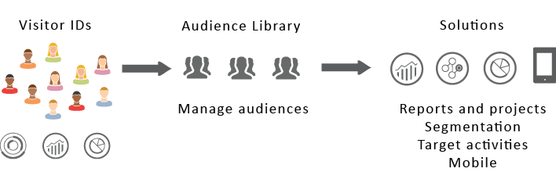

# Experience Cloud målgrupper {#topic_679810123CAA4E0CA4FA3417FB0100C7}

[!DNL Audience Library] visar målgrupper i Experience Cloud. Målgrupper är samlingar med besökare (en lista med [!DNL Experience Cloud] ID:n). Ni kan hantera översättningen av besöksdata till målgruppssegmentering. Att skapa och hantera målgrupper liknar alltså att skapa och använda segment. Du kan också dela målgruppssegmentet till produkter och tjänster i [!DNL Experience Cloud].

Målgrupper kan skapas eller härledas från olika källor, till exempel:

* Nya skapade i [!DNL Experience Cloud]
* [!DNL Analytics] segment publicerade till [!DNL Experience Cloud]
* [!DNL Audience Manager]

**Realtid kontra historiska målgrupper**

Alla målgrupper, oavsett var de finns, är tillgängliga för användning i realtid med målinriktning. Målgrupper som delas från Analytics till Audience Manager är dock inte tillgängliga för målgruppsanpassning i realtid. Systemet utvärderar målgrupper på två sätt:

* Historiska målgrupper från Analytics utvärderas var fjärde timme. Total tid att bearbeta och dela tar upp till åtta timmar. Historiska målgrupper omfattar alltid återkommande besökare.
* Målgrupper i realtid hämtas från Experience Cloud-målgrupper och utvärderas i realtid.

## Hur applikationer använder målgrupper {#concept_01EB9345C5344597BC94A864EDD38EE1}

I följande tabell beskrivs hur målgrupper används i Experience Cloud-program:

| Lösning | Beskrivning |
|--- |--- |
| Experience Cloud-målgrupper | Skapa, hantera och dela målgrupper direkt med hjälp av målgruppsbiblioteket. Du kan:<ul><li>Använd målgrupper i realtid med råanalysattribut.</li><li>Kombinera målgrupper för att skapa sammansatta bilder och förena realtids- och historiska data.</li><li>Se grafiska vyer av uppskattad målgruppsstorlek.</li></ul> Mer information om vilken typ av målgrupp du vill skapa finns i [Alternativ för att skapa målgrupper](https://experienceleague.adobe.com/docs/experience-cloud-kcs/kbarticles/KA-16471.html?lang=sv-SE). |
| Analytics  | Vid segmentering kan du skapa ett segment, kombinera det med en rapportsvit och sedan publicera segmentet på Experience Cloud. Om du publicerar segmentet visas det på sidan [!DNL Audience Library] i Experience Cloud. (Mer information finns i [Publicera segment till Experience Cloud](https://experienceleague.adobe.com/docs/analytics/components/segmentation/segmentation-workflow/seg-publish.html?lang=sv-SE) i hjälpen för [!DNL Analytics].) Publiken finns också som målgrupp för en kampanjupplevelse som levereras av [!DNL Adobe Target] och i [!DNL Audience Manager] . När du delar en målgrupp från [!DNL Adobe Analytics] och väljer den för användning i en aktiv kampanj skickas de besökarprofiler som uppfyller villkoren för segmentdefinition för de senaste 90 dagarna till [!UICONTROL Audience Services]. Gränsen för delade målgrupper har ökat till 75. Publiker som delas till Experience Cloud från [!DNL Analytics] får inte överstiga 20 miljoner unika medlemmar. På grund av cachelagring kräver borttagna rapportsviter i Analytics 12 timmar innan borttagningen visas i Experience Cloud. |
| Mobile-tjänster | Analysera mobiltrafik med hjälp av solbränsvisualisering i rapporten [!UICONTROL Device Types]. |
| [!DNL Target] | [ID-tjänsten](https://experienceleague.adobe.com/docs/id-service/using/home.html?lang=sv-SE) förenar besökar-ID:n och data i en enda användbar profil som kan användas i olika program. Kryssrutan [!UICONTROL Publish to Experience Cloud] när segment skapas i Adobe Analytics gör att segmentet kan vara tillgängligt i Adobe Target anpassade målgruppsbibliotek. Ett segment som skapats i [!DNL Analytics] eller [!DNL Audience Manager] kan användas för aktiviteter i [!DNL Target]. Du kan till exempel skapa kampanjaktiviteter baserat på konverteringsstatistik för [!DNL Analytics] och målgruppssegment som skapats i [!DNL Analytics]. |
| [!DNL Audience Manager] | Delade målgrupper är tillgängliga i [!DNL Audience Manager]-segmentering. Alla Experience Cloud-målgrupper är inbyggda i [!DNL Audience Manager], som innehåller:<ul><li>Inbyggd automatisering av hur de delas och används i arbetsflöden</li><li>Destinationer utanför webbplatsen</li><li>Look-alike-modellering</li></ul> |
| Campaign | <ul><li>Importera delade målgrupper från olika Adobe Experience Cloud-program till Adobe Campaign.</li><li>Exportera mottagarlistor i form av delade målgrupper. Dessa delade målgrupper kan användas i de olika Adobe Experience Cloud-program som du använder.</li></ul> |
| Advertising Cloud | Använd målgruppen som mål. |

{style="table-layout:auto"}

>[!IMPORTANT]
>
>När en besökare har kvalificerat sig för den målgrupp som delas från Analytics finns det en 4-8 timmars fördröjning innan den informationen kan användas i [!DNL Target], Ad Cloud och Campaign Standard.

## Gränssnittselement i målgruppsbiblioteket {#section_D04ACEF61CEF4B189AE6BA9F40D0DBF4}

[!DNL Experience Cloud] innehåller ett bibliotek för att skapa och hantera målgrupper med inbyggd målgruppsidentifiering i realtid.

**[!UICONTROL Experience Cloud]** > **[!UICONTROL Experience Platform]** > **[!UICONTROL People]** > **[!UICONTROL Audience Library]**

| Element | Beskrivning |
|--- |--- |
| Nyhet | [Skapa en målgrupp](create.md). |
| Titel och beskrivning | En kolumnrubrik som identifierar och beskriver målgruppen. |
| Upphovsman | Personen som skapade målgruppssegmentet. |
| Källa | Identifierar var målgruppen skapades.<ul><li>**Analys:** Ett segment som skapats i Adobe Analytics och sedan publicerats till Experience Cloud.</li><li>**Experience Cloud:** En ny publik [som har skapats i Experience Cloud-målgrupper](create.md).</li><li>**Audience Manager:** Publiker som har skapat Audience Manager visas automatiskt i Experience Cloud-målgrupper.</li></ul> |
| Aktuell storlek | Den aktuella målgruppsstorleken. |
| Aktiv | Segmentets aktiva status. |

{style="table-layout:auto"}

## Publicera målgrupper från Adobe Analytics

Mer information finns i [Publicera segment till Experience Cloud](https://experienceleague.adobe.com/sv/docs/analytics/components/segmentation/segmentation-workflow/seg-publish) i Adobe Analytics-dokumentationen.
