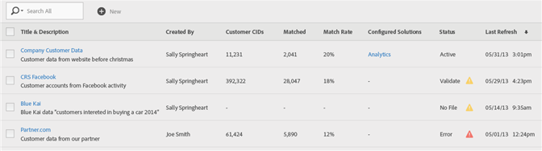

# Skapa en kundattributskälla och överför datafilen

Skapa kundattributskällan (CSV- och FIN-filer) och överför data. Du kan aktivera datakällan när du är klar. När datakällan är aktiv delar du attributdata till Analytics och Target.

## Arbetsflöde för kundattribut {#concept_BF0AF88E9EF841219ED4D10754CD7154}


>[!IMPORTANT]
>
>För att få tillgång till den här funktionen måste användarna tilldelas till produktprofilen för kundattribut (kundattribut - standardåtkomst). Navigera till **[!UICONTROL Administration]** > **[!UICONTROL Admin Console]** > **[!UICONTROL Products]**. Om *kundattribut* visas som en av [!UICONTROL product profiles] kan du börja. Användare som läggs till i gruppen Kundattribut ser menyn [!UICONTROL Customer Attributes] till vänster i Experience Cloud-gränssnittet.
>
>Om du vill använda funktionen Kundattribut måste användarna också tillhöra programnivågrupper (Analytics eller [!DNL Target]).

## Skapa en datafil {#task_B5FB8C0649374C7A94C45DCF2878EA1A}

Dessa data är företagskunddata från din CRM. Informationen kan omfatta prenumerationsdata för produkter, inklusive medlems-ID, berättigade produkter, mest lanserade produkter osv.

1. Skapa en `.csv`.

   >[!NOTE]
   >
   >Senare i den här processen drar och släpper du `.csv` för att överföra filen. Om du [överför via FTP](t-upload-attributes-ftp.md#task_591C3B6733424718A62453D2F8ADF73B) behöver du emellertid också en `.fin`-fil med samma namn som `.csv`.

   Exempel på kunddatafil för företag:

   

1. Granska viktig information i [Datafilskrav](crs-data-file.md) innan du överför filen innan du fortsätter.
1. [Skapa en kundattributkälla och överför data](t-crs-usecase.md), som beskrivs nedan.

## Skapa attributkällan och överför datafilen {#task_09DAC0F2B76141E491721C1E679AABC8}

Utför dessa steg på Source-sidan Skapa nytt kundattribut i Experience Cloud.

>[!IMPORTANT]
>
>När du skapar, ändrar eller tar bort kundattributskällor är det en fördröjning på upp till en timme innan ID:n börjar synkronisera med den nya datakällan. Du måste ha administratörsbehörighet i Audience Manager för att kunna skapa eller ändra källor för kundattribut. Kontakta Audience Manager kundtjänst eller konsult för att få administrationsrättigheter.

1. I [!DNL Experience Cloud] väljer du menyikonen  .
1. Under **[!DNL Experience Platform]** väljer du **[!UICONTROL People]** > **[!UICONTROL Customer Attributes]**.

   På sidan [!UICONTROL Customer Attributes] kan du hantera och redigera befintliga attributdatakällor.

   

1. Välj **[!UICONTROL New]**.

   

1. Konfigurera följande fält på sidan [!UICONTROL Edit Customer Attribute Source]:

   * **[!UICONTROL Name:]** Ett eget namn för datakällan för dataattribut. För [!DNL Adobe Target] får attributnamn inte innehålla blanksteg. Om ett attribut med ett blanksteg skickas ignorerar [!DNL Target] det. Andra tecken som inte stöds är: `< , >, ', "`.

   * **[!UICONTROL Description:]** (Valfritt) En beskrivning av datakällan för dataattribut.

   * **[!UICONTROL Alias ID:]** Representerar en källa med kundattributdata, till exempel ett specifikt CRM-system. [!UICONTROL Alias ID] är ett unikt ID som används i din [!UICONTROL Customer Attribute Source]-kod. ID:t ska vara unikt, med gemener, utan blanksteg. Värdet som anges i fältet [!UICONTROL Alias ID] för en kundattributskälla i Experience Cloud ska matcha värdena som skickas från implementeringen (oavsett om det är via Platform Data Collection eller JavaScript för Mobile SDK.)

     >[!IMPORTANT]
     >
     >Om du tar bort en datakälla som är kopplad till ett alias-ID blir alias-ID inte tillgängligt, eftersom alias-ID sparas i flera tjänster och används för att mappa profiler mellan dem.

     Alias-ID motsvarar vissa områden där du anger ytterligare värden för Kund-ID. Exempel:

      * **Taggar:** Alias-ID motsvarar värdet *Integreringskod* under [!UICONTROL Customer Settings] i verktyget [Experience Cloud ID-tjänst](https://experienceleague.adobe.com/docs/experience-platform/tags/home.html?lang=sv).

      * **Besökar-API:** Alias-ID:t motsvarar de ytterligare [Kund-ID:n](https://experienceleague.adobe.com/docs/id-service/using/reference/authenticated-state.html) som du kan associera med varje besökare.

        Till exempel *&quot;crm_id&quot;* i:

        ```
        "crm_id":"67312378756723456"
        ```

      * **iOS:** Alias-ID motsvarar *&quot;idType&quot;* i [visitorSyncIdentifiers:identifiers](https://experienceleague.adobe.com/docs/mobile-services/ios/overview.html).

        Exempel:

        `[ADBMobile visitorSyncIdentifiers:@{@<`**`"idType"`**`:@"idValue"}];`

      * **Android™:** Alias-ID motsvarar *&quot;idType&quot;* i [syncIdentifiers](https://experienceleague.adobe.com/docs/mobile-services/android/overview.html).

        Exempel:

        `identifiers.put(`**`"idType"`**`, "idValue");`

        Se [Utnyttjar flera datakällor](crs-data-file.md#section_76DEB6001C614F4DB8BCC3E5D05088CB) för mer information om databearbetning för Alias ID-fältet och Kund-ID:n.

   * **[!UICONTROL File Upload:]** Du kan dra och släppa datafilen `.csv` eller överföra data via FTP. (FTP kräver också en `.fin`-fil.) Se [ Överföra data via FTP ](t-upload-attributes-ftp.md#task_591C3B6733424718A62453D2F8ADF73B) .

     >[!IMPORTANT]
     >
     >Det finns särskilda krav på datafiler. Mer information finns i [Datafilskrav](crs-data-file.md).

     När du har överfört filen visas tabelldata under rubriken [!UICONTROL File Upload] på den här sidan. Du kan validera schemat, konfigurera prenumerationer eller konfigurera FTP.

     **Filöverföringsgrafik**

     

   * **[!UICONTROL Unique Customer ID:]** Visar hur många unika ID:n du har överfört till den här attributkällan.

   * **[!UICONTROL Customer-Provided IDs Aliased to Experience Cloud Visitor IDs:]** Visar hur många ID:n som har alias för Experience Cloud Visitor-ID:n.

   * **[!UICONTROL Customer-Provided IDs with High Alias Counts:]** Visar antalet kundtillhandahållna ID:n med 500 eller fler Experience Cloud-besökar-ID:n med alias. Dessa kundtillhandahållna ID:n representerar förmodligen inte individer utan snarare någon typ av delad inloggning. Attributen som är kopplade till dessa ID:n distribueras till de 500 senaste aliaserade Experience Cloud-besökar-ID:n, tills aliasantalet är 10 000. Systemet gör sedan kundens ID ogiltigt och distribuerar inte längre tillhörande attribut.

## Validera schemat {#task_404AAC411B0D4E129AB3AC8B7BE85859}

Med valideringsprocessen kan du mappa visningsnamn och beskrivningar till överförda attribut (strängar, heltal, tal och så vidare). Du kan även ta bort attribut genom att uppdatera schemat.

Se [Verifiera schemat](validate-schema.md).

Mer information om hur du tar bort attribut finns i [(Valfritt) Uppdatera schemat (tar bort attribut) ](t-crs-usecase.md).

## (Valfritt) Uppdatera schemat (ta bort attribut) {#task_6568898BB7C44A42ABFB86532B89063C}

Så här tar du bort attribut och ersätter attribut i schemat.

1. På sidan [!UICONTROL Edit Customer Attribute Source] tar du bort prenumerationen **[!UICONTROL Target]** eller **[!UICONTROL Analytics]** (under [!UICONTROL Configure Subscriptions]).
1. [Överför en ny datafil med uppdaterade fält](t-crs-usecase.md).

## Konfigurera prenumerationer och aktivera attributkällan {#task_1ACA21198F0E46A897A320C244DFF6EA}

När du konfigurerar en prenumeration ställs dataflödet in mellan Experience Cloud och program. Genom att aktivera attributkällan kan data flöda till prenumererade program. De kundposter som du har överfört matchas med inkommande ID-signaler från din webbplats eller ditt program.

Se [Konfigurera prenumerationer](subscription.md).

**Så här aktiverar du en attributkälla**

Leta reda på rubriken [!UICONTROL Activate] på sidan [!UICONTROL Create New or Edit Customer Attribute Source] och välj sedan **[!UICONTROL Active]**.


## Använd kundattribut i Adobe Analytics {#task_7EB0680540CE4B65911B2C779210915D}

Med de data som nu finns i program som Adobe Analytics kan ni rapportera data, analysera dem och vidta lämpliga åtgärder i era marknadsföringskampanjer.

I följande exempel visas ett [!DNL Analytics]-segment baserat på de överförda attributen. I det här segmentet visas [!DNL Photoshop Lightroom] prenumeranter vars mest lanserade produkt är Photoshop.


När du publicerar ett segment på Experience Cloud blir det tillgängligt i Experience Cloud Publiker och Audience Manager.

## Använd kundattribut i Adobe Target {#task_FC5F9D9059114027B62DB9B1C7D9E257}

I [!DNL Target] kan du välja ett kundattribut i avsnittet [!UICONTROL Visitor Profile] när du skapar en målgrupp. Alla kundattribut har prefixet `crs.` i listan. Kombinera dessa attribut efter behov med andra dataattribut för att skapa målgrupper.


Se [Skapa en ny publik](https://experienceleague.adobe.com/docs/target/using/audiences/create-audiences/audiences.html) i hjälpen för [!DNL Target].
