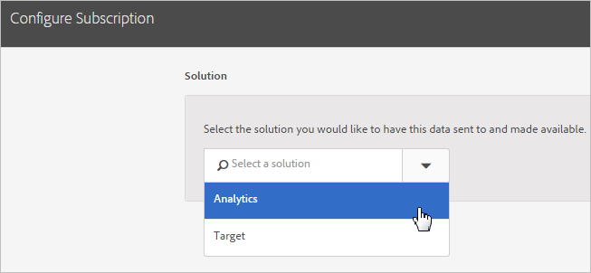

# Så här konfigurerar du prenumerationer i Experience Cloud

Lär dig mer om programdatakällor och hur du konfigurerar prenumerationer. Prenumerationer aktiverar [!DNL Customer Attribute] dataflöde mellan Experience Cloud och program ([!DNL Analytics] och [!DNL Target]).

En Adobe Analytics-prenumeration kan t.ex. aktivera attributdata i rapporter. Om du använder Adobe Target kan du överföra kundattribut för målgruppsanpassning och segmentering.

**[!UICONTROL Customer Attribute Source]** > **[!UICONTROL Create New Customer Attribute Source]** > **[!UICONTROL New]**

| Element | Beskrivning |
|--- |--- |
| Lösning | **Adobe Analytics**  Välj [!DNL Analytics], anger de rapportsviter som du vill ta emot attributdata till och de attribut som ska tas med. **Adobe Target**  Du kan överföra kundattribut för målinriktning och segmentering. Den här funktionen är användbar om du vill ha ett test som bygger på attributdata eller göra data tillgängliga för segmentering i Analytics. Data för kundattribut som har överförts för en besökare finns tillgängliga vid inloggning, i **[!DNL Target]** > **Målgrupper**. Flera datakällor stöds. När du  [ange kund-ID](core-services.md) på din webbplats verifiera att minst ett av aliaserna prenumererar på [!DNL Target]. |
| Report Suite (Analytics) | Rapporteringssviterna från Analytics. Du kan inte lägga till mer än totalt 10 rapportsviter i Analytics-prenumerationer i en enda attributkälla. När du väljer vilka rapportsviter som ska inkluderas bör du tänka på följande:<ul><li>Välj rapportsviter som har en gemensam uppsättning autentiserade kunder. Om de autentiserade kunderna i en rapportserie inte överlappar de autentiserade kunderna i en annan rapportserie, skiljer du dessa rapportsviter åt i olika attributkällor.</li><li>Om det är möjligt bör rapportsviterna som ingår i en attributkälla ha liknande trafikvolym.</li></ul> Om du har fler än 10 rapportsviter med en gemensam uppsättning autentiserade kunder kan du konfigurera ytterligare källor för kundattribut, var och en med upp till 10 rapportsviter. |
| Attribut som ska inkluderas (analys och [!DNL Target]) | De attribut som du vill skicka till programmet.  När du konfigurerar prenumerationer och väljer attribut gäller följande begränsningar _per rapportsvit,_ beroende på vilka program du äger:<ul><li>Foundation: 0</li><li>Välj: 3</li><li>Prime: 15</li><li>Ultimate: 200</li><li>Standard: 3 totalt</li><li>Premium: 200 per rapportserie</li><li>[!DNL Target] Standard: 5</li><li>[!DNL Target] Premium: 200</li></ul> **Obs!** När du uppgraderar till Analytics Premium tar det 24 timmar innan ytterligare attribut finns tillgängliga. Ett Max-fel för attributprenumeration kan visas under den här fördröjningen. |

{style="table-layout:auto"}
