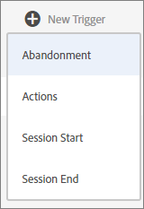

# Experience Cloud-utlösare

[!UICONTROL Triggers] i Experience Cloud kan ni identifiera, definiera och övervaka viktiga konsumentbeteenden och sedan generera kommunikation mellan olika tillämpningar för att engagera besökarna på nytt.

## Översikt över utlösare {#topic_4F21FCE9A64E46E8B6D51F494FA652A7}

Ni kan använda triggers i realtidsbeslut och personalisering. Exempel:

* Konfigurera snabb ommarknadsföring för övergivna varukorgar eller övergivna varukorgar med borttagna produkter
* Ofullständiga blanketter och tillämpningar
* Åtgärder eller sekvenser av åtgärder på platsen

>[!NOTE]
>
>Mer information om hur du använder [!UICONTROL Triggers] är tillgängligt i [Campaign Standard](https://experienceleague.adobe.com/docs/campaign-standard/using/integrating-with-adobe-cloud/working-with-campaign-and-triggers/using-triggers-in-campaign.html?lang=en).

### Typer av utlösare

I allmänhet kan en utlösare ta 15-90 minuter att starta en marknadsföringskampanj. Den här fördröjningen varierar beroende på implementeringen av datainsamling, inläsning på pipeline, anpassad konfiguration av den definierade utlösaren och arbetsflödet i Adobe Campaign.

* **Övergiven:** Du kan skapa en utlösare som aktiveras när en besökare tittar på en produkt men inte lägger till något i kundvagnen.
* **Åtgärd:** Du kan skapa utlösare, till exempel, som aktiveras efter anmälan till nyhetsbrev, e-postprenumerationer eller program för kreditkort (bekräftelser). Om du är återförsäljare kan du skapa en utlösare för en besökare som registrerar sig för ett lojalitetsprogram. I media och underhållning skapar du triggers för besökare som tittar på en viss show och kanske vill svara med en enkät.
* **Sessionsstart och sessionsslut:** Skapa en utlösare för händelser för sessionsstart och sessionsslut.

## Skapa en Experience Cloud-utlösare {#task_821F37183AC045E5AC8EED20317598FE}

Skapa en utlösare och konfigurera villkoren för utlösaren. Du kan till exempel ange villkor för en utlösares regler under ett besök, till exempel mått som Cart Abandon eller dimensioner som produktnamnet. När reglerna är uppfyllda körs utlösaren.

>[!NOTE]
>
>Det finns för närvarande en teknisk gräns på 100 utlösare.

1. I Experience Cloud väljer du väljer **[!UICONTROL Data Collection/Launch]**.
2. På [!UICONTROL Triggers] kort, välj **[!UICONTROL Manage Triggers]**.
3. Välj **[!UICONTROL New Trigger]** anger du sedan typ av utlösare:

   

4. Konfigurera utlösaren genom att fylla i följande fält och dra mått och dimensionsobjekt till regelns behållare:

   | Element | Beskrivning |
   |--- |--- |
   | [!UICONTROL Name] | Det egna namnet för den här utlösaren. |
   | [!UICONTROL Description] | Beskrivning av den här utlösaren, hur du använder den och så vidare. |
   | [!UICONTROL Report Suite] | Analytics [rapportsvit](https://experienceleague.adobe.com/docs/analytics/admin/manage-report-suites/report-suites-admin.html) används för den här utlösaren. Den här inställningen identifierar de rapportdata som ska användas. |
   | Besök måste omfatta Besök får inte omfatta Utlös efter ingen åtgärd Inkludera metadata | Du kan definiera villkor eller besökarbeteenden som du vill ska inträffa och beteenden som du inte vill ska inträffa. Regler för en enkel utlösare för övergivna varukorgar kan till exempel vara:<ul><li>Besök måste omfatta följande: [!UICONTROL Cart Addition] (metrisk) och  [!UICONTROL Exists]. (Du kan förfina regeln ytterligare med en viss produktvy eller med dimensioner som webbläsartyper.)</li><li>Besök får inte omfatta  [!UICONTROL Checkout].</li><li>Utlös efter ingen åtgärd i: 10 minuter.</li><li>[!UICONTROL Include Meta Data]: Gör att du kan lägga till en viss [!DNL Campaign] dimensioner eller variabler som är relevanta för en besökares beteende. Det här fältet kan vara användbart för Adobe Campaign att skapa rätt e-postmeddelande för återmarknadsföring.</li></ul> Du kan ange  [!UICONTROL Any],  [!UICONTROL And] eller  [!UICONTROL Or] logik i eller mellan behållare, beroende på vilka villkor du anger, är viktiga för regeln. |
   | [!UICONTROL Container] | [!UICONTROL Containers] är där du anger och lagrar regler, villkor eller filter som definierar en utlösare. Om du vill att händelser ska inträffa samtidigt placerar du dem i samma behållare. Det innebär att varje behållare bearbetas oberoende på träffnivå. Om du till exempel har två behållare som förenas med operatorn And kan du förvänta dig att reglerna kvalificeras när två träffar uppfyller kraven. |
   | Starta ny session efter | Skapa en utlösare för händelser för sessionsstart och sessionsslut. |

   {style="table-layout:auto"}

5. Välj **[!UICONTROL Save]**.
6. Använd utlösare för [remarketing i realtid](https://experienceleague.adobe.com/docs/campaign-standard/using/integrating-with-adobe-cloud/working-with-campaign-and-triggers/about-adobe-experience-cloud-triggers.html?lang=en) in [!DNL Adobe Campaign].

### Exempelutlösare

Exempel på utlösare för Experience Cloud:

#### Cart Abandonment Trigger

På följande sida visas regler som du kan använda för en [!UICONTROL Cart Abandonment] utlösare, baserat på produkter som visas under ett besök.

#### Utlösare för referent

Följande utlösare utlöses när en träff kommer in med produkten från Men&#39;s Boots och Facebook hänvisningsprogram. För de två kriterierna (*produkter* och *hänvisare*) som ska utvärderas i samma träff, ska läggas till i samma behållare.

